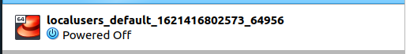
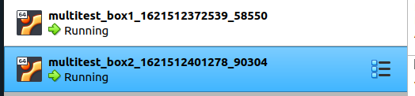
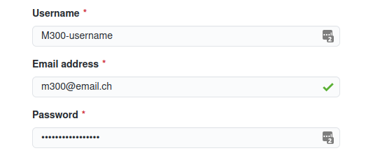
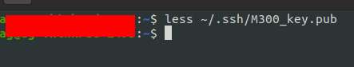
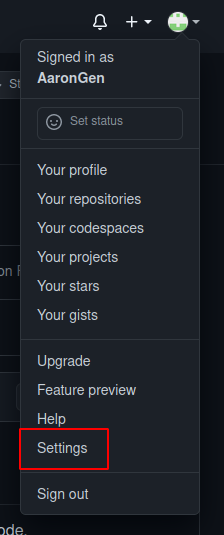
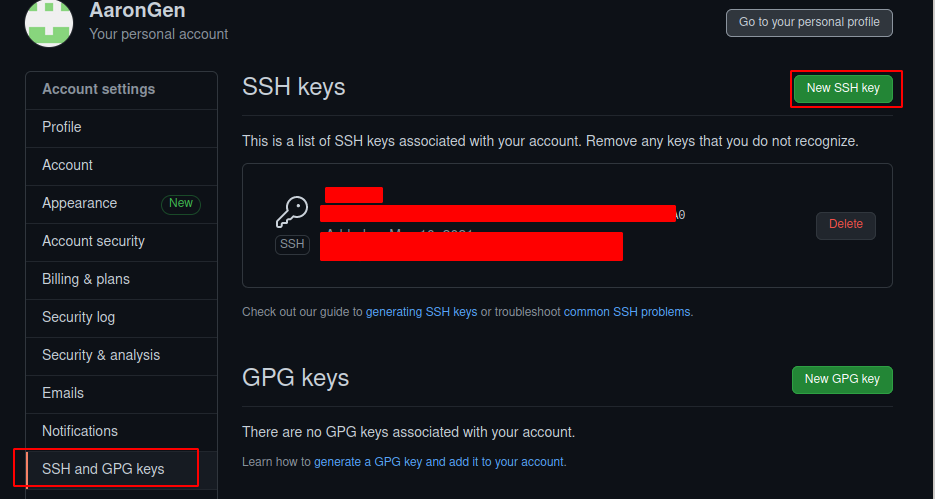
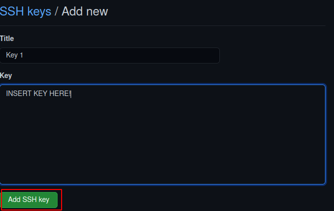

# Einleitung
Einleitung zum LB1 Projekt (Erklärungen)

Info
- Ich arbeite in Ubuntu 21.04
- 

# 1 - Virtualbox
## 1.1 - Installation
Da ich auf Linux arbeite, kann ich dies mit nur einem befehl Installieren.

```Shell
$ apt install virtualbox
```
# 2 - Vagrant
## 2.1 - Installation
Um Vagrant zu Installieren muss folgendes gemacht werden.

```Shell
$ apt install Vagrant
```

### 2.2 - Einfache Bedienung

Übersicht der Befehle
| Befehl                    | Beschreibung                                                      |
| ------------------------- | ----------------------------------------------------------------- |
| `vagrant init`            | Initialisiert im aktuellen Verzeichnis eine Vagrant-Umgebung und erstellt, falls nicht vorhanden, ein Vagrantfile |
| `vagrant up`              |  Erzeugt und Konfiguriert eine neue Virtuelle Maschine, basierend auf dem Vagrantfile |
| `vagrant ssh`             | Baut eine SSH-Verbindung zur gewünschten VM auf                   |
| `vagrant status`          | Zeigt den aktuellen Status der VM an                              |
| `vagrant port`            | Zeigt die Weitergeleiteten Ports der VM an                        |
| `vagrant halt`            | Stoppt die laufende Virtuelle Maschine                            |
| `vagrant destroy`         | Stoppt die Virtuelle Maschine und zerstört sie.                   |

### 2.3 - Enfache VM Erstellen
Um eine einfache VM zu erstellen, muss folgendes getan werden.

Als erstes, muss die Box heruntergeladen und hinzugefügt werden.
```Shell 
$ vagrant box add ubuntu/hirsute64 # Ubuntu 21.04 hinzufügen
```
Um die Box zu Initialisieren.
```Shell
$ mkdir ~/vagrant/box1
$ vagrant init ubuntu/hirsute64 # Ubuntu 21.04 box Initialisieren
$ vagrant up
```
Die Boxen könenn hier gefunden werden: https://app.vagrantup.com/boxes/search

### 2.4 - Vagrantfile
Das Vagrantfile befindet sich in dem Verzeichnis in dem der Befehl "vagrant init <box>" ausgeführt wurde.\
Ohne Weitere Konfiguration sieht es folgendermassen aus.
```Shell 
Vagrant.configure("2") do |config|
  config.vm.box = "user/box"
end
```
Die vagrant VMs werden standartmässig in Virtualbox laufen gelassen, solange man dies im Vagrantfile nicht ändert.\


Nach dem Editieren des vagrantfiles, muss folgender befehl ausgeführt werden
```Shell 
$ vagrant reload
``` 

Um der VM einen Hostname zu geben, muss das vagrantfile folgendermassen editiert werden.\
unter config.vm.box = ""
```Shell 
config.vm.hostname = "deinHostname"
```

Um der VM eine IP Adresse zu geben,  muss das vagrantfile folgendermassen editiert werden.
```Shell 
config.vm.network "private_network", ip: "10.9.8.7"
```

Um dinge wie Z. b. Ram oder Cpu einstellen zu können, muss dies in folgendem Block getan werden.
```Shell 
config.vm.provider "virtualbox" do |vb|
  vb.name = "VM-NAME"
  vb.memory = 2048
  vb.cpus = 2
end
```
Um einen Port auf den Host weiter zu leiten, kann folgenes getan werden.\
In diesem Beispiel wird der Guest Port 80 auf den Host port 8080 umgeleitet.
```Shell 
config.vm.network "forwarded_port", guest:80, host:8080
```
Um ein Host folder dem Guest zur verfügung zu stellen, kann folgendes in die Konfiguration geschrieben werden.\
Hier wird nun der ordner data, der im vagrant ordner drinn ist, auf /home/vagrant/data gemapt.
```Shell 
config.vm.synced_folder "./data", "/home/vagrant/data"
```
Um bei der Installation einer VM automatisch Befehle ausführen zu lassen, muss folgender Bereich auskommentert oder erstellt werden.\
Die einzelnen bash Befehle, können dann dazwischen geschrieben werden.
```Shell
config.vm.provision "shell", inline: <<-SHELL
   apt-get update
   apt-get install -y apache2
SHELL
```

Um ganze Scripts auszuführen, kann folgender Befehl genutzt werden.
```Shell
config.vm.provision "shell", path: "script.sh"
```
### 2.5 - Mehrere Vms erstellen
Um mit einem Vagrantfile mehrere Vms zu erstellen, muss folgenes unternommen werden.

Mit Vagrant ist es möglich mehrere Vms mit nur einem File zu erstellen, dies Zeige ich hier anhand eines Beispieles.
```Shell 
$ cd /path/to/vmstorage
$ mkdir multivm
$ cd multivm
$ vagrant init ubuntu/xenial64
$ nano Vagrantfile
```
```Shell 
FilePath: /path/to/vmstorage/multivm/Vagrantfile

-------------------------------------------------

Vagrant.configure("2") do |config|
  config.vm.box = "ubuntu/xenial64" #Select box Image

  # Define Box 1
  config.vm.define "box1" do |box1|
   box1.vm.hostname = "box1"
   box1.vm.network "private_network", ip: "10.9.8.1"
  end

  # Define Box 2
  config.vm.define "box2" do |box2|
   box2.vm.hostname = "box2"
   box2.vm.network "private_network", ip: "10.9.8.2"
  end

end
```
Um die VMs zu starten
```Shell 
$ vagrant up
um nur eine der beiden zu starten: vagrant up box1 oder box2
```
Nun laufen die beiden VMs und sie können auch miteinander kommunizieren.\


Um eine der beiden VMs zu **kontrollieren**
```Shell 
$ vagrant ssh box1
oder
$ vagrant ssh box2
```


# 3 - Visual Studio Code
## 3.1 - Installation
Um VScode zu Installieren, muss folgendes getan werden.
```Shell 
snap install --classic code
```
## 3.2 - Konfiguration
### 3.2.1 - Addons
Um VScode für Mardown und GIT ready zu machen, habe ich folgende Addons installiert.
- GitLens (Mit Gitlens kann in einem File angezeigt werden wann was von wem und in welchem commit geändert oder hinzugefügt wurde.)\

- Markdown All in One (Markdown All in One fügt einige kleine shortcuts und optische verschönerungen zum vagrantfile hinzu).
- Code Spell checker German und English (Code Spell checker ist ein Gramatik und rechtschreib überprüfung für vscode)
  
# 4 - GIT
## 4.1 - Github Account
Um sich einen Github Account anzulegen, muss auf die Internetseite "github.com" navigiert werden.\
Hier kann dann oben rechts auf "Sign up" gedrückt werden.


Jetzt müssen die Account Daten eingegeben werden.



Nun ist der Account erstellt.
## 4.2 - Installation
Um Git zu Installieren, muss folgendes getan werden.
```Shell 
$ apt install git
```
## 4.3 - Bedienung
```Shell 
$ git --version # Aktielle Git Version anzeigen
```
```Shell 
$ git config --global user.name "git_username" # Usernamen Setzen
```
```Shell 
$ git config --global user.email "e@mail.adresse" # E-Mail setzen
```
```Shell 
$ git clone <repository> # Repository Herunterladen / Klonen
```
```Shell 
$ git status # Status des aktuellen git Repository anzeigen.
```
```Shell 
$ git remote add <repository> <remote> # fügt einen Remote Git Server hinzu (beispiel: Github)
```
```Shell 
$ git pull <remote> <branch> # dateien von Remote Server pullen
```
```Shell 
$ git add . # Alle Dateien für den nächsten commit hinzufügen
```
```Shell 
$ git commit -m "commit Nachricht" # Dateien commiten
```
```Shell 
$ git push <remote> <branch> # dateien auf Remote Server pushen
```

## 4.4 - SSH Key
Zuerst muss in der Konsole einen SSH Key erstellt werden.

```Shell 
$ ssh-keygen -t rsa -b 4096 # erstellt einen 4096 bytes langen RSA (SSH) key

Generating public/private rsa key pair.
Enter a file in which to save the key (~/.ssh/id_rsa): ~/.ssh/M300_key
Enter passphrase (empty for no passphrase): [Passwort]
Enter same passphrase again: [Passwort wiederholen]
```

Nachdem der Key erstellt wurde, muss er im Terminal angezeigt werden, dies muss mit folgendem Befehl getan werden.\

  
Wenn der Public key nun in der Konsole angezeigt wird,muss dieser Kopiert werden.\
  



Den zuvor kopierten Public Key hier unter "KEY" Pasten.\
Der Name kann frei gewählt werden.\


Wenn der Key nun in Github eingetragen ist, muss er auf dem Lokalen PC noch mit dem Repository verbunden werden.

```Shell 
$ ssh git@github.com -T -i ~/.ssh/<dein KEY>
Hi User! Youve successfully authenticated, but GitHub does not provide shell access.
Connection to github.com closed.
```
Um schonmal in die Zukunft zu denken und mehrere SSH keys zu verbinden, kann ein eintrag in der SSH Config gemacht werden.\
Diese befindet sich unter folgendem pfad.
```Shell 
nano ~/.ssh/config
```
Jetzt kann einfach folgender eintrag hinzugefügt werden
```Shell 
Host github
    Hostname github.com
    User git
    IdentityFile ~/.ssh/keyfile
    IdentitiesOnly yes
```
Um nun das Git Repository lokal zu Spiegeln, muss folgendes gemacht werden.
```Shell
$ cd /pfad/zu/repository/
$ git init
$ git remote add origin https://github.com/<dein Username>/<dein GIT Repository>
$ git remote set-url github:<dein Username>/<dein GIT Repository> # github darf nur geschrieben werden, wenn der ssh config Eintrag gemacht wurde, sonnst git@github.com.
$ git pull origin master
```

# 5 - Projekt
## 5.1 - Projekt Umfang

- vagrant

Konzept: 
Backend
- DB Server
- File/Data Server
- NGINX/apache Reverse Proxy
  - config file in shared folder (einfach kopieren)
- LDAP Server?

Frontend
- apache2 Webserver mit Nextclud gui

## 5.2 Umgebung vorbereiten
```Shell 
$ mkdir ~/M300/LB1/Project/
$ cd ~/M300/LB1/Project/
$ vargrant box add debian/buster64
$ vagrant init debian/buster64
$ nano Vagrantfile

```


# 1000 - Quellen

Aufgaben und einige Texte: https://github.com/mc-b/M300/tree/master

<a rel="license" href="http://creativecommons.org/licenses/by-nc-sa/3.0/ch/">

</a><br />Dieses Werk ist lizenziert unter einer <a rel="license" href="http://creativecommons.org/licenses/by-nc-sa/3.0/ch/">Creative Commons Namensnennung - Nicht-kommerziell - Weitergabe unter gleichen Bedingungen 3.0 Schweiz Lizenz</a>


<br><br><br><br><br><br>


## Service-Aufbau 
Text

## Umsetzung


## Testing
Text

## Quellen
