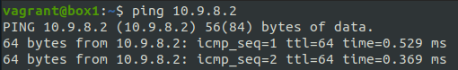

# Einleitung
Einleitung zum LB1 Projekt (Erklärungen)
Info
- Ich arbeite in Ubuntu 21.04
- 
# 1 - Virtualbox
## 1.1 - Installation
Da ich auf Linux arbeite, kann ich dies mit nur einem befehl Installieren.
```Shell
$ apt install virtualbox
```
# 2 - Vagrant
## 2.1 - Installation
Um Vagrant zu Installieren muss folgendes gemacht werden.
```Shell
$ apt install Vagrant
```
### 2.2 - Einfache Bedienung
Übersicht der Befehle
| Befehl                    | Beschreibung                                                      |
| ------------------------- | ----------------------------------------------------------------- |
| `vagrant init`            | Initialisiert im aktuellen Verzeichnis eine Vagrant-Umgebung und erstellt, falls nicht vorhanden, ein Vagrantfile |
| `vagrant up`              |  Erzeugt und Konfiguriert eine neue Virtuelle Maschine, basierend auf dem Vagrantfile |
| `vagrant ssh`             | Baut eine SSH-Verbindung zur gewünschten VM auf                   |
| `vagrant status`          | Zeigt den aktuellen Status der VM an                              |
| `vagrant port`            | Zeigt die Weitergeleiteten Ports der VM an                        |
| `vagrant halt`            | Stoppt die laufende Virtuelle Maschine                            |
| `vagrant destroy`         | Stoppt die Virtuelle Maschine und zerstört sie.                   |
### 2.3 - Enfache VM Erstellen
Um eine einfache VM zu erstellen, muss folgendes getan werden.
Als erstes, muss die Box heruntergeladen und hinzugefügt werden.
```Shell 
$ vagrant box add ubuntu/hirsute64 # Ubuntu 21.04 hinzufügen
```
Um die Box zu Initialisieren.
```Shell
$ mkdir ~/vagrant/box1
$ vagrant init ubuntu/hirsute64 # Ubuntu 21.04 box Initialisieren
$ vagrant up
```
Die Boxen könenn hier gefunden werden: https://app.vagrantup.com/boxes/search
### 2.4 - Vagrantfile
Das Vagrantfile befindet sich in dem Verzeichnis in dem der Befehl "vagrant init <box>" ausgeführt wurde.\
Ohne Weitere Konfiguration sieht es folgendermassen aus.
```Shell 
Vagrant.configure("2") do |config|
  config.vm.box = "user/box"
end
```
Die vagrant VMs werden standartmässig in Virtualbox laufen gelassen, solange man dies im Vagrantfile nicht ändert.\

Nach dem Editieren des vagrantfiles, muss folgender befehl ausgeführt werden
```Shell 
$ vagrant reload
``` 
Um der VM einen Hostname zu geben, muss das vagrantfile folgendermassen editiert werden.\
unter config.vm.box = ""
```Shell 
config.vm.hostname = "deinHostname"
```
Um der VM eine IP Adresse zu geben,  muss das vagrantfile folgendermassen editiert werden.
```Shell 
config.vm.network "private_network", ip: "10.9.8.7"
```
Um dinge wie Z. b. Ram oder Cpu einstellen zu können, muss dies in folgendem Block getan werden.
```Shell 
config.vm.provider "virtualbox" do |vb|
  vb.name = "VM-NAME"
  vb.memory = 2048
  vb.cpus = 2
end
```
Um einen Port auf den Host weiter zu leiten, kann folgenes getan werden.\
In diesem Beispiel wird der Guest Port 80 auf den Host port 8080 umgeleitet.
```Shell 
config.vm.network "forwarded_port", guest:80, host:8080
```
Um ein Host folder dem Guest zur verfügung zu stellen, kann folgendes in die Konfiguration geschrieben werden.\
Hier wird nun der ordner data, der im vagrant ordner drinn ist, auf /home/vagrant/data gemapt.
```Shell 
config.vm.synced_folder "./data", "/home/vagrant/data"
```
Um bei der Installation einer VM automatisch Befehle ausführen zu lassen, muss folgender Bereich auskommentert oder erstellt werden.\
Die einzelnen bash Befehle, können dann dazwischen geschrieben werden.
```Shell
config.vm.provision "shell", inline: <<-SHELL
   apt-get update
   apt-get install -y apache2
SHELL
```
Um ganze Scripts auszuführen, kann folgender Befehl genutzt werden.
```Shell
config.vm.provision "shell", path: "script.sh"
```
### 2.5 - Mehrere Vms erstellen
Um mit einem Vagrantfile mehrere Vms zu erstellen, muss folgenes unternommen werden.
Mit Vagrant ist es möglich mehrere Vms mit nur einem File zu erstellen, dies Zeige ich hier anhand eines Beispieles.
```Shell 
$ cd /path/to/vmstorage
$ mkdir multivm
$ cd multivm
$ vagrant init ubuntu/xenial64
$ nano Vagrantfile
```
```Shell 
FilePath: /path/to/vmstorage/multivm/Vagrantfile
-------------------------------------------------
Vagrant.configure("2") do |config|
  config.vm.box = "ubuntu/xenial64" #Select box Image
  # Define Box 1
  config.vm.define "box1" do |box1|
   box1.vm.hostname = "box1"
   box1.vm.network "private_network", ip: "10.9.8.1"
  end
  # Define Box 2
  config.vm.define "box2" do |box2|
   box2.vm.hostname = "box2"
   box2.vm.network "private_network", ip: "10.9.8.2"
  end
end
```
Um die VMs zu starten
```Shell 
$ vagrant up
um nur eine der beiden zu starten: vagrant up box1 oder box2
```
Nun laufen die beiden VMs und sie können auch miteinander kommunizieren.\

Um eine der beiden VMs zu **kontrollieren**
```Shell 
$ vagrant ssh box1
oder
$ vagrant ssh box2
```



### 2.6 - Json
Das Vagrantfile kann Json dateien einlesen, und somit viel dynamischer konfiguriert werden.

Hier ein Kleines Beispiel.
```Shell 
FilePath: /path/to/vmstorage/json/Vagrantfile
-------------------------------------------------
nodes_config = (JSON.parse(File.read("nodes.json")))['nodes']
Vagrant.configure(2) do |config|
  config.vm.box = "ubuntu/focal64"
  nodes_config.each do |node| 
    node_name = node[0]
    node_values = node[1]
    config.vm.define node_name do |config|
      config.vm.hostname = node_name
      config.vm.network :private_network, ip: node_values['ip']
      config.vm.provider :virtualbox do |vb|
        vb.customize ["modifyvm", :id, "--memory", node_values['memory']] 
        vb.customize ["modifyvm", :id, "--name", node_name]
        vb.cpus = node_values['cpu']
      end
      config.vm.provision :shell, :path => node_values['script']
    end
  end
end
```
Das JSON file könnte folgendermassen aussehen.
```Json
FilePath: /path/to/vmstorage/json/nodes.json
-------------------------------------------------
{
  "nodes":{
    "node1":{
      "ip":"10.9.8.11",
      "memory":3072,
      "cpu":2
      "script":"db.sh",
    },
    "node2":{
      "ip":"10.9.8.13",
      "memory":1024,
      "cpu":2
      "script":"nc.sh",
    }
  }
}
```
# 3 - Visual Studio Code
## 3.1 - Installation
Um VScode zu Installieren, muss folgendes getan werden.
```Shell 
snap install --classic code
```
## 3.2 - Konfiguration
### 3.2.1 - Addons
Um VScode für Mardown und GIT ready zu machen, habe ich folgende Addons installiert.
- __GitLens__ (Mit Gitlens kann in einem File angezeigt werden wann was von wem und in welchem commit geändert oder hinzugefügt wurde.)\

- __Markdown All in One__ (Markdown All in One fügt einige kleine shortcuts und optische verschönerungen zum vagrantfile hinzu).
- __Code Spell checker__ German und English (Code Spell checker ist ein Gramatik und rechtschreib überprüfung für vscode)
  
# 4 - GIT
## 4.1 - Github Account
Um sich einen Github Account anzulegen, muss auf die Internetseite "github.com" navigiert werden.\
Hier kann dann oben rechts auf "Sign up" gedrückt werden.

Jetzt müssen die Account Daten eingegeben werden.

Nun ist der Account erstellt.
## 4.2 - Installation
Um Git zu Installieren, muss folgendes getan werden.
```Shell 
$ apt install git
```
## 4.3 - Bedienung
```Shell 
$ git --version # Aktielle Git Version anzeigen
```
```Shell 
$ git config --global user.name "git_username" # Usernamen Setzen
```
```Shell 
$ git config --global user.email "e@mail.adresse" # E-Mail setzen
```
```Shell 
$ git clone <repository> # Repository Herunterladen / Klonen
```
```Shell 
$ git status # Status des aktuellen git Repository anzeigen.
```
```Shell 
$ git remote add <repository> <remote> # fügt einen Remote Git Server hinzu (beispiel: Github)
```
```Shell 
$ git pull <remote> <branch> # dateien von Remote Server pullen
```
```Shell 
$ git add . # Alle Dateien für den nächsten commit hinzufügen
```
```Shell 
$ git commit -m "commit Nachricht" # Dateien commiten
```
```Shell 
$ git push <remote> <branch> # dateien auf Remote Server pushen
```
## 4.4 - SSH Key
Zuerst muss in der Konsole einen SSH Key erstellt werden.
```Shell 
$ ssh-keygen -t rsa -b 4096 # erstellt einen 4096 bytes langen RSA (SSH) key
Generating public/private rsa key pair.
Enter a file in which to save the key (~/.ssh/id_rsa): ~/.ssh/M300_key
Enter passphrase (empty for no passphrase): [Passwort]
Enter same passphrase again: [Passwort wiederholen]
```
Nachdem der Key erstellt wurde, muss er im Terminal angezeigt werden, dies muss mit folgendem Befehl getan werden.\

  
Wenn der Public key nun in der Konsole angezeigt wird, muss dieser Kopiert werden.\
  


Den zuvor kopierten Public Key hier unter "KEY" Pasten.\
Der Name kann frei gewählt werden.\

Wenn der Key nun in Github eingetragen ist, muss er auf dem Lokalen PC noch mit dem Repository verbunden werden.
```Shell 
$ ssh git@github.com -T -i ~/.ssh/<dein KEY>
Hi User! Youve successfully authenticated, but GitHub does not provide shell access.
Connection to github.com closed.
```
Um schonmal in die Zukunft zu denken und mehrere SSH keys zu verbinden, kann ein eintrag in der SSH Config gemacht werden.\
Diese befindet sich unter folgendem pfad.
```Shell 
nano ~/.ssh/config
```
Jetzt kann einfach folgender eintrag hinzugefügt werden
```Shell 
Host github
    Hostname github.com
    User git
    IdentityFile ~/.ssh/keyfile
    IdentitiesOnly yes
```
Um nun das Git Repository lokal zu Spiegeln, muss folgendes gemacht werden.
```Shell
$ cd /pfad/zu/repository/
$ git init
$ git remote add origin https://github.com/<dein Username>/<dein GIT Repository>
$ git remote set-url github:<dein Username>/<dein GIT Repository> # github darf nur geschrieben werden, wenn der ssh config Eintrag gemacht wurde, sonnst git@github.com.
$ git pull origin master
```
# 5 - Projekt
## 5.1 - Projekt Umfang
Für die LB1 vom Modul300 habe ich mich dafür entschieden, eine art Cloud für SaaS zu ersetellen, mit der per Befehl automatisch Nextclouds deployed werden.

Da ich schon lange vor hatte, mich tiefer in Bash/Shellscript einzuarbeiten, habe ich diese möglichkeit direkt genutzt, und mich dazu entschieden, die "Cloud" mit Bash und Vagrant umzusetzen.

### Ziele:

- Es soll ein Bash Script erstellt werden, mit dem "die Cloud" über argumente gesteuert werden kann.
- Es soll einen "__init__" Befehl geben, mit diesem soll "die Cloud" Erstellt werden.
- Es soll ein "__deploy__" Befehl geben, mit diesem soll "die Cloud" eine (oder mehrere) Nextcloud instanzen deployen.
- Es soll einen "__start__" und einen "__stop__" Befehl geben, mit diesem soll eine instanz gestoppt oder gestartet werden.
- Es soll einen "__destroy__" Befehl geben, mit diesem soll eine instanz oder die ganze Cloud zerstört/deinstalliert werden können.
- Es soll einen "__list__" Command geben, mit dem alle instanzen aufgelistet werdenkönnen.
## 5.2 - Umgebung vorbereiten
```Shell 
$ mkdir ~/M300/LB1/Project/
$ cd ~/M300/LB1/Project/
$ vargrant box add ubuntu/focal64
$ vagrant init ubuntu/focal64
```
## 5.3 - Vagrantfile
Für dieses Projekt, werde ich ein JSON file erstellen, indem alle Informationen über alle Nodes und Vms vorhanden sind.\
Durch dieses json filem kann sich das VAGRANTFILE die node Informationen von selbst eintragen, und mit diesen arbeiten.

```shell
$ nano ~/M300/LB1/Project/Vagrantfile
```
```ruby
# (c) Aaron Gensetter, 2021
# Part from "Ultra Bad Cloud (UBC)"

nodes_config = (JSON.parse(File.read("nodes.json")))['nodes'] # Select nodes

Vagrant.configure(2) do |config|

  config.vm.box = "ubuntu/focal64" # Ubuntu 20.04

  nodes_config.each do |node| # Loop through all Nodes
    node_name = node[0] # name of node 
    node_values = node[1] # content/meta of node

    config.vm.define node_name do |config|
      # configures all forwarding ports in JSON array
      ports = node_values['ports']
      ports.each do |port|
        config.vm.network :forwarded_port, host:  port['host'], guest: port['guest'], id: port[':id']
      end

      config.vm.hostname = node_name
      config.vm.network :private_network, ip: node_values['ip'] # IP Adress

      config.vm.provider :virtualbox do |vb|
        vb.customize ["modifyvm", :id, "--memory", node_values['memory']] # set VM memory
        vb.customize ["modifyvm", :id, "--name", node_name] # set VM Name
        vb.cpus = node_values['cpu']
      end

      config.vm.provision :shell, :path => node_values['script'], args: node_values['args'] # set installation script
    end
  end
end
```
### 5.2.1 - Json file
Ohne nodes (nach init)
```json 
{
  "nodes":{
    "dbs":{
      "description": "Database Server",
      "ip": "10.9.8.101",
      "ports":[],
      "memory": 3072,
      "cpu": 2,
      "script": "scripts/dbinstall.sh",
      "args":""
    }
  }
}
```
Mit Nodes (nach deploy)
```json
{
  "nodes": {
    "dbs": {
      "description": "Database Server",
      "ip": "10.9.8.101",
      "ports": [],
      "memory": 3072,
      "cpu": 2,
      "script": "scripts/dbinstall.sh",
      "args": ""
    },
    "node11": {
      "description": "nextcloud frontend",
      "ip": "10.9.8.11",
      "ports": [
        {
          "guest": 80,
          "host": 8011
        }
      ],
      "memory": 1024,
      "cpu": 2,
      "script": "scripts/ncinstall.sh",
      "args": "node11"
    },
    "node12": {
      "description": "nextcloud frontend",
      "ip": "10.9.8.12",
      "ports": [
        {
          "guest": 80,
          "host": 8012
        }
      ],
      "memory": 1024,
      "cpu": 2,
      "script": "scripts/ncinstall.sh",
      "args": "node12"
    }
  }
}
```
## 5.4 Control Script
Wichtig ist noch zusagen, dass ich vor diesem Projekt nicht viel bash Erfahrung hatte, und ich dieses Projekt genommen habe, um mich tiefer in bash zu arbeiten.
```bash
#!/bin/bash

# (c) Aaron Gensetter, 2021
# Part from "Ultra Bad Cloud (UBC)"

# Define Variables
JSONFILE="nodes.json"
DBS_IP="10.9.8.101"
DBS_USER="root"
DBS_PW="Password123"

# Define Shell colors
RED=`tput setaf 1`
GREEN=`tput setaf 2`
YELLOW=`tput setaf 3`
BLUE=`tput setaf 6`
RESET=`tput sgr0`

USAGE="${YELLOW}Usage: ${0} <init:deploy [amount]:destroy [node]:start <node>:stop <node>:list>${RESET}"
FRESHJSON="{\"nodes\":{\"dbs\":{\"description\":\"Database Server\",\"ip\":\"${DBS_IP}\",\"ports\":[],\"memory\":3072,\"cpu\":2,\"script\":\"scripts/dbinstall.sh\",\"args\":\"\"}}}"


# check if user is Root user
if [[ $UID -eq 0 ]]; then
    echo "${RED}You cant't be root, to use this script!${RESET}"
    exit 1
fi

####################################################################
# FUNCTIONS
####################################################################
# Check Node
checkNodeStatus () {
    NODE="$1" # Get node from argument 1
    TEST=$(vagrant status ${NODE}) # get the Vagrant status message
    # Define REGEX vars for the status
    REGEX1="${NODE} *running"
    REGEX2="${NODE} *poweroff"
    REGEX3="${NODE} *not *created"

    # Check the Status of the Nodes
    if [[ $TEST =~ $REGEX3 ]]; then 
        return 3 # not created
    elif [[ $TEST =~ $REGEX2 ]]; then 
        return 2 # poweroff
    elif [[ $TEST =~ $REGEX1 ]]; then 
        return 1 # running
    else
        return 0 # down / not found
    fi
}

# Stop Node
stopNode () {
    NODE=$1 # Get node from argument 1
    checkNodeStatus $NODE
    STATUS=$?
    if [[ $STATUS -ne 0 && $STATUS -ne 2 && $STATUS -ne 3 ]]; then # if node is running
        echo "${GREEN}Stopping node \"${NODE}\"${RESET}"
        vagrant halt $NODE
        exit 0 # success
    else 
        echo "${YELLOW}Node \"${NODE}\" is already stopped or does not exist.${RESET}"
        exit 1 # no success
    fi

}

# Start Node
startNode () {
    NODE=$1 # Get node from argument 1
    checkNodeStatus $NODE
    if [[ $? -eq 1 ]]; then # if node is not running
        echo "${YELLOW}Node \"${NODE}\" is already running.${RESET}"
        exit 1 # no success
    else 
        echo "${GREEN}Starting node \"${NODE}\"${RESET}"
        vagrant up $NODE
        exit 0 # success
    fi
}

# Deploy Nextcloud
deployNode () {
    AMOUNT=$1 # get Loop amount from argument 1
    REGEX='^[1-9]+$'
    if ! [[ $AMOUNT =~ $REGEX ]]; then # check if Amount is a numeric number
        AMOUNT=1 # else, set amount to 0
    fi
    echo "${BLUE}Deploying ${AMOUNT} Nodes${RESET}"
    OUTPUTARRAY=()
    COUNTER=0
    while [ $COUNTER -lt $AMOUNT ]; do # Loop Amount times through deployment
        IP_PREFIX="10.9.8." # make IP prefix
        PORT_PREFIX="80" # make Port Prefix

        NODES=($(jq '.nodes | keys | .[]' $JSONFILE)) # Get all active nodes from json

        NODES=("${NODES[@]:1}") # cut the first (Database Server) from array
        
        if [[ ${NODES[@]} != "" ]]; then # check if any node is in the json file
            NODEARRAY=()
            for string in ${NODES[@]}; do # loop through nodes
                OUTPUT=${string:5:1} # Cut node away and leve number
                NODEARRAY+=("${OUTPUT}") # Add node number to array
            done
            NUM=1
            EXITER=0
            while [[ NUM -eq 1 ]]; do # Loop through until new node number is found
                if [[ $EXITER -eq 0 ]]; then # check if new node number is found
                    NUMBER=$(shuf -i 11-99 -n 1) # Generate random number between 11 and 99
                    for NODE in ${NODEARRAY[@]}; do # Loop through nodes array
                        EXITER=0
                        if [[ $NUMBER -eq $NODE ]]; then # check if random number matches current node number
                            break # does match (BAD)
                        else 
                            EXITER=1 # does not match (GOOD)
                        fi
                    done
                else
                    NUM=0 # Found new not used node number
                fi
            done
        else
            # If no old VM is in the json file, generate a complete new id
            NUMBER=$(shuf -i 11-99 -n 1) # Generate random number between 11 and 99
        fi

        echo "${GREEN}Deploying...${RESET}"
        
        checkNodeStatus dbs
        STATUS=$?
        if [[ STATUS -eq 1 ]]; then # check if Database Server is Online

            # Define variables (Add new found node number to prefixes)
            IP="${IP_PREFIX}${NUMBER}"
            PORT="${PORT_PREFIX}${NUMBER}"
            NODE="node${NUMBER}"

            mysql -h $DBS_IP -u $DBS_USER -p$DBS_PW -e "CREATE DATABASE ${NODE};" # create new db for node
            echo "${GREEN}Created Database for ${NODE}"
            NEWNODE="{
                \"${NODE}\":{
                    \"description\":\"nextcloud frontend\",
                    \"ip\":\"${IP}\",
                    \"ports\":[
                        {
                            \"guest\":80,
                            \"host\":${PORT}
                        }
                    ],
                    \"memory\":1024,
                    \"cpu\":2,
                    \"script\":\"scripts/ncinstall.sh\",
                    \"args\":\"${NODE}\"
                }
            }" # generating new node json object
            echo $(jq --argjson NEWNODE "$NEWNODE" '.nodes += $NEWNODE' $JSONFILE) > $JSONFILE # overwriting  old json file with new informations

            #vagrant reload # reload vagrant json file
            vagrant up $NODE # start new node up

            echo "${GREEN}Deployed ${NODE}${RESET}"

            OUTPUTARRAY+=("${NODE}: http://localhost:${PORT} Username: ${BLUE}admin${RESET} Passwort: ${BLUE}Password123${RESET}") # Add information to Output array
        else
            # DB Server is not Online
            echo "${YELLOW}Warning! DB Server is Offline${RESET}"
            echo "${YELLOW}- Please do ${0} start dbs, or ${0} init.${RESET}"
            echo "${RED}Error! cant create new node"
        fi
        ((COUNTER++)) # increase counter +1
    done
    echo "${GREEN}All Nodes Deployed!${RESET}}"
    for NODE in ${OUTPUTARRAY[@]}; do
        echo "${NODE}"
    done
}

# Remove Nextcloud node
destroyNode () {
    NODE2=$1 # Get node from argument 1
    if [[ $NODE2 != "dbs" ]]; then # check if node is not the Database Server
        checkNodeStatus $NODE2
        STATUS=$?
        if [[ $STATUS -eq 1 || $STATUS -eq 2 || $STATUS -eq 3 ]]; then # check if node exists (cant destroy not existing node)
            echo "${GREEN}destroying ${NODE2}...${RESET}"
            checkNodeStatus "dbs"
            STATUS=$?
            if [[ STATUS -eq 1 ]]; then # Check if the Database server is Online
                mysql -h $DBS_IP -u $DBS_USER -p$DBS_PW -e "DROP DATABASE ${NODE2};" # Remove Database from node
            else
                echo "${YELLOW}DB Server is Offline${RESET}"
                echo "${YELLOW}cant remove ${NODE2}s Databse${RESET}"
            fi

            vagrant destroy $NODE2 # Destroy node
                
            FILTER=".nodes.${NODE2}" # adding node as jq filter
            echo $(jq "del($FILTER)" $JSONFILE) > $JSONFILE # Remove node from json file

            #vagrant reload # Reload Vigrant Json file
            echo "${GREEN}Destroy Successful${RESET}"

        else
            echo "${RED}${NODE2} is not online.${RESET}"
        fi  
    else
        echo "${RED}Can't destroy ${NODE2}${RESET}"
    fi
}

####################################################################
# SCRIPT
####################################################################

# Check if user is really in the Vagrant Folder
FOLDER=$(pwd)
read -p "${BLUE}Are you in the correct folder? \"${FOLDER}\". y or n: ${RESET}" ACCEPT # ask user if he is in the right folder
ACCEPT=$(echo $ACCEPT | tr a-z A-Z) # make $accept to uppercase
if [[ "${ACCEPT}" != "Y" ]]; then # check if user accepts
    echo "${RED}you have exited the script${RESET}"
    exit 1 # exit script if user don't says "Y"
fi

# Check if arguments are set
if [[ ${#} -eq 0 ]]; then
    echo "${RED}Not enough arguments. ${USAGE}${RESET}"
    exit 1
fi

# Init -----------------------------------------------------------------------------
if [[ "${1}" ==  "init" ]]; then
    # Only start init things
    echo "${GREEN}Create Init vagrant...${RESET}"
    echo $FRESHJSON > $JSONFILE  # restore nodes json file to defauts (just db Server)
    vagrant destroy -f # destroy all existant 
    checkNodeStatus dbs
    STATUS=$?
    if [[ $STATUS -eq 3 ]] # check if Database is not created
    then
        vagrant up dbs
    fi
# Start -----------------------------------------------------------------------------
elif [[ "${1}" ==  "start" ]]; then
    if [[ $# -ge 2 ]]; then
        startNode $2 # use specified node name to start
    else
        # if no node is given, exit
        echo "${RED}Not enough arguments. ${USAGE}${RESET}"
        exit 1
    fi
# Stop -----------------------------------------------------------------------------
elif [[ "${1}" ==  "stop" ]]; then
    if [[ $# -ge 2 ]]; then
        stopNode $2 # use specified node name to stop
    else
        # if no node is given, exit
        echo "${RED}Not enough arguments. ${USAGE}${RESET}"
        exit 1
    fi
# Deploy -----------------------------------------------------------------------------
elif [[ "${1}" ==  "deploy" ]]; then
    if [[ $# -ge 2 ]]; then
        deployNode $2 # if a number is specified, use it
    else 
        deployNode 1 # if no number is specified, use 1
    fi
# Destroy -----------------------------------------------------------------------------
elif [[ "${1}" ==  "destroy" ]]; then
    if [[ $# -ge 2 ]]; then
        # if a node is specified, destroy this node
        destroyNode $2
    else
        # if no args, destoy all
        vagrant destroy -f # Destroy all machines and nodes
        echo $FRESHJSON > $JSONFILE # restore nodes json file to defauts (just db Server)
    fi
# List -----------------------------------------------------------------------------
elif [[ "${1}" ==  "list" ]]; then
    echo "${GREEN}listing items...${RESET}"
    NODES=($(jq '.nodes | keys | .[]' $JSONFILE)) # Select all nodes
    NODES=("${NODES[@]:1}") # cut the first (Database Server) from array
    if [[ ${#NODES[@]} -eq 0 ]]; then
        echo "${RED}No Nodes found!${RESET}"
        exit 1
    fi
    for NODE in ${NODES[@]}; do # Loop through all elements
        # Get Elements from json file
        DESCRIPTION=$(jq -r ".nodes.${NODE}.description" $JSONFILE)
        IP=$(jq -r ".nodes.${NODE}.ip" $JSONFILE)
        PORT=$(jq -r ".nodes.${NODE}.ports | .[].host" $JSONFILE )
        echo "${RED}${NODE}: ${BLUE}$DESCRIPTION: ${YELLOW}${IP}:${PORT}${RESET}" # Display nodes
    done
# Else -----------------------------------------------------------------------------
else
    # Display this message if no argument matches
    echo "${RED}Wrong arguments. ${USAGE}${RESET}"
fi
```

## 5.5 Installations Scripts
### 5.5.1 Datenbank Server
```bash
#!/bin/bash

# (c) Aaron Gensetter, 2021
# Part from "Ultra Bad Cloud (UBC)"

## Define vars
MYSQL_ROOT_PW="Password123"

## Installation
apt update -y
#apt upgrade -y

apt install mariadb-server mariadb-client -y

sed -e '/bind-address            = 127.0.0.1/ s/^#*/#/' -i /etc/mysql/mariadb.conf.d/50-server.cnf # comment out the bind adress, to open it to public
systemctl restart mariadb

## Install / Configure MariaDB
mysql -e "UPDATE mysql.user SET plugin='mysql_native_password' WHERE User='root';" # make shure the user can login, with the right plugin
mysql -e "UPDATE mysql.user SET Password = PASSWORD('${MYSQL_ROOT_PW}') WHERE User = 'root';" # Set a password for The root user
mysql -e "DROP USER IF EXISTS ''@'localhost';" # Remove the Anonymous User
mysql -e "DROP USER IF EXISTS ''@'$(hostname)';"
mysql -e "DROP DATABASE IF EXISTS test;" # Remove the Demo database
mysql -e "UPDATE mysql.user SET Host='%' WHERE User='root';"

mysql -e "FLUSH PRIVILEGES;"
```
### 5.5.2 Nextcloud Server
```bash
#!/bin/bash

# (c) Aaron Gensetter, 2021
# Part from "Ultra Bad Cloud (UBC)"

## Check if some args are given
if [[ $# -eq 0 ]]
then
    echo "exit"
    exit 1
fi

## Define vars
# Nextcloud
NEXTCLOUD_LINK="https://download.nextcloud.com/server/releases/nextcloud-21.0.2.zip"
NEXTCLOUD_ADMIN_USER="admin"
NEXTCLOUD_ADMIN_PW="Password123"

# Database
MYSQL_HOST="10.9.8.101"
MYSQL_USER="root"
MYSQL_PW="Password123"

## Installation
apt update -y 
#apt upgrade -y

apt install unzip -y
apt install apache2 apache2-utils -y
systemctl start apache2
systemctl enable apache2
apt install imagemagick php-imagick libapache2-mod-php7.4 php7.4-common php7.4-mysql php7.4-fpm php7.4-gd php7.4-json php7.4-curl php7.4-zip php7.4-xml php7.4-mbstring php7.4-bz2 php7.4-intl php7.4-bcmath php7.4-gmp -y # Install needed PHP modules
a2enmod php7.4 # enable php
systemctl restart apache2
rm /var/www/html/index.html
wget "${NEXTCLOUD_LINK}" # Download Nextcloud
unzip nextcloud*.zip -d /var/www/html # Unpack Nextcloud
cp /var/www/html/nextcloud/* /var/www/html -R
rm /var/www/html/nextcloud -R
chown www-data:www-data /var/www/html/ -R

su -l www-data -s /bin/bash -c "php /var/www/html/occ maintenance:install --database 'mysql' --database-host '${MYSQL_HOST}' --database-name '${1}' --database-user '${MYSQL_USER}' --database-pass '${MYSQL_PW}' --admin-user '${NEXTCLOUD_ADMIN_USER}' --admin-pass '${NEXTCLOUD_ADMIN_PW}'" # Configure/Install Nextcloud

```
# 1000 - Quellen
Aufgaben und einige Texte: https://github.com/mc-b/M300/tree/master\
<a rel="license" href="http://creativecommons.org/licenses/by-nc-sa/3.0/ch/">

</a><br />Dieses Werk ist lizenziert unter einer <a rel="license" href="http://creativecommons.org/licenses/by-nc-sa/3.0/ch/">Creative Commons Namensnennung - Nicht-kommerziell - Weitergabe unter gleichen Bedingungen 3.0 Schweiz Lizenz</a>
<br><br><br><br><br><br>
## Service-Aufbau 
Text
## Umsetzung
## Testing
Text
## Quellen

	Udemy https://www.udemy.com/course/linux-shell-scripting-projects/[10.06.2021] Shell script parts
	MC-B github