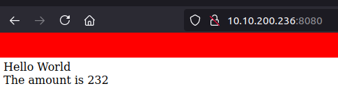
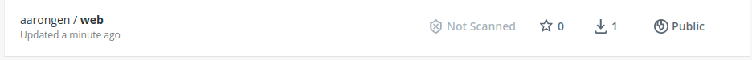

<span style="font-size:40px">LB2 - M300</span>

<span style="font-size:25px">Aaron Gensetter</span>

<br>

# Inhalt

# Einleitung
Für die LB1 vom Modul 300 habe ich mich für ein Projekt entschieden dass in Kapitel __make link__ weiter beschrieben wird.

Da ich auf einem Ubuntu 20.04 arbeite, werde ich nur die Installations- und Konfigurationsmethoden dafür erklären.

# 1 - Docker
## 1.1 - Installation
```shell
apt install docker.io
```

## 1.2 - Bedienung

```shell
$ docker run <container>
```

Mit __docker run__ kann ein Container auf verschiedene art und weisen gestartet werden, je nach argument.

```shell
$ docker ps
```

__docker ps__ gibt eine Liste der aktuellen Container aus.

```shell
$ docker images
```

__docker images__ gibt eine Liste der aktuellen lokalen images aus.

```shell
$ docker [container/image] rm <container>
```

Mit __docker rm__ können container und/oder Images gelöscht werden.

```shell
$ docker start <container>
```

Mit __docker start__ können container gestartet werden.

```shell
$ docker stop <container>
```

Mit __docker stop__ können container gestoppt werden.

```shell
$ docker kill <container>
```

Bei __docker kill__ wird der hauptprozess gekillt und der Container gestoppt.

## 1.3 - Dockerfile
Anweisungen

`FROM`

Welches Base Image von hub.docker.com verwendet werden soll, z.B. ubuntu:16.04

`ADD`

Kopiert Dateien aus dem Build Context oder von URLs in das Image.

`CMD`

Führt die angegebene Anweisung aus, wenn der Container gestartet wurde. Ist auch ein ENTRYPOINT definiert, wird die Anweisung als Argument für ENTRYPOINT verwendet.

`COPY`

Wird verwendet, um Dateien aus dem Build Context in das Image zu kopieren. Es gibt die zwei Formen COPY src dest und COPY ["src", "dest"]. Das JSON-Array-Format ist notwendig, wenn die Pfade Leerzeichen enthalten.

`ENTRYPOINT`

Legt eine ausführbare Datei (und Standardargumente) fest, die beim Start des Containers laufen soll.
Jegliche CMD-Anweisungen oder an docker run nach dem Imagenamen übergebenen Argumente werden als Parameter an das Executable durchgereicht.
ENTRYPOINT-Anweisungen werden häufig genutzt, um "Start-Scripts" anzustossen, die Variablen und Services initialisieren, bevor andere übergebene Argumente ausgewertet werden.

`ENV`

Setzt Umgebungsvariablen im Image.

`EXPOSE`

Erklärt Docker, dass der Container einen Prozess enthält, der an dem oder den angegebenen Port(s) lauscht.

`HEALTHCHECK`

Die Docker Engine prüft regelmässig den Status der Anwendung im Container.
HEALTHCHECK --interval=5m --timeout=3s \ CMD curl -f http://localhost/ || exit 1`

`MAINTAINER`

Setzt die "Autor-Metadaten" des Image auf den angegebenen Wert.

`RUN`

Führt die angegebene Anweisung im Container aus und bestätigt das Ergebnis.

`SHELL`

Die Anweisung SHELL erlaubt es seit Docker 1.12, die Shell für den folgenden RUN-Befehl zu setzten. So ist es möglich, dass nun auch direkt bash, zsh oder Powershell-Befehle in einem Dockerfile genutzt werden können.

`USER`

Setzt den Benutzer (über Name oder UID), der in folgenden RUN-, CMD- oder ENTRYPOINT-Anweisungen genutzt werden soll.

`VOLUME`

Deklariert die angegebene Datei oder das Verzeichnis als Volume. Besteht die Datei oder das Verzeichnis schon im Image, wird sie bzw. es in das Volume kopiert, wenn der Container gestartet wird.

`WORKDIR`

Setzt das Arbeitsverzeichnis für alle folgenden RUN-, CMD-, ENTRYPOINT-, ADD oder COPY-Anweisungen.

# 1.4 - Webapp in Container

Um einen PHP / Apache2 Server in einem Container laufen zu lassen, muss folgendes gemacht werden.

```shell
$ mkdir ~/m300/webapp
$ mkdir ~/m300/webapp/web
$ cd ~/m300/webapp
```

PHP file erstellen.

```shell
$ nano ~/m300/webapp/web/index.php
```

```php
<?php

$amount = 1 + 77 * 3;
echo "Hello World<br>";
echo "The amount is {$amount}";
```

Dockerfile erstellen.

```shell
$ nano Dockerfile
```

```txt
FROM php:apache
LABEL MAINTAINER=aaron.gensetter@edu.tbz.ch
WORKDIR /var/www/html
COPY ./web/index.php index.php
EXPOSE 80
```

Image erstellen / builden.

```shell
$ docker image build -t aarongen/web:1.0 .
```

Docker container laufen lassen, (detached), den port 8080 auf den port 80 weiterleiten.

```shell
$ docker container run --detach --name web -p 8080:80 aarongen/web:1.0
```



Docker image auf Dockerhub pushen.

```shell
$ docker login --username=aarongen
```
```shell
$ docker image push aarongen/web:1.0
```




# 800 - Projekt
## 800.1 - Projekt Umfang
xxxxx

### Ziele:
xxxx

## 800.2 - Umgebung vorbereiten
### 800.2.1 - Server
Für dieses Projekt werde ich nicht auf die TBZ Cloud setzen, sondern eine eigene VM auf meinem Proxmox Server installieren, auf dieser werden alle docker Container ausgeführt.

```shell
$ apt install docker.io
```

## 800.3 - Dockerfile


## 800.800 Testing
# 900 - Reflexion

Ich habe in diesem Modul das erste mal mit docker gerabeitet

# 1000 - Quellen

- MC-B github: https://github.com/mc-b/M300/tree/master [22.06.2021]
- Inhaltsverzeichnis: https://ecotrust-canada.github.io/markdown-toc/ [22.06.2021]
- Nextcloud über occ Installieren: https://docs.nextcloud.com/server/latest/admin_manual/installation/command_line_installation.html [22.06.21]
- Netcloud occ: https://docs.nextcloud.com/server/latest/admin_manual/configuration_server/occ_command.html [22.06.21]

<br><br>

<a rel="license" href="http://creativecommons.org/licenses/by-nc-sa/3.0/ch/">

</a><br />Dieses Werk ist lizenziert unter einer <a rel="license" href="http://creativecommons.org/licenses/by-nc-sa/3.0/ch/">Creative Commons Namensnennung - Nicht-kommerziell - Weitergabe unter gleichen Bedingungen 3.0 Schweiz Lizenz</a>


# NOTES (TEMp)
apt install docker.io

docker login --username=aarongen

mkdir TEMP_Docker
cd TEMP_Docker
git clone https://gitlab.com/ser-cal/Container-CAL-webapp_v1.git 
cd Container-CAL-webapp-v1/
cd APP 

docker image build -t aarongen/webapp_one:1.0 .
docker image push aarongen/webapp_one:1.0

docker container run -d --name aar-web -p 8080:8080 aarongen/webapp_one:1.0


Version 1
    self build (dockerfile)

Version 2 
    container from dockerhub