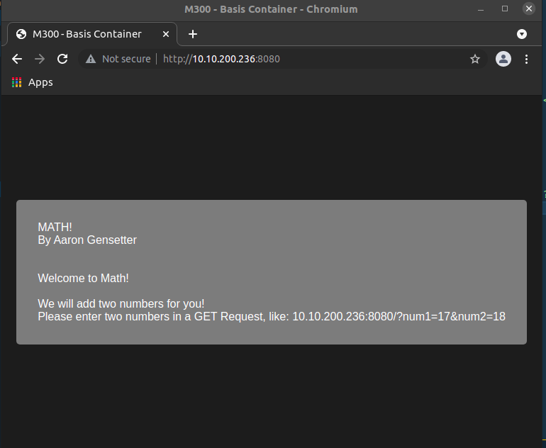
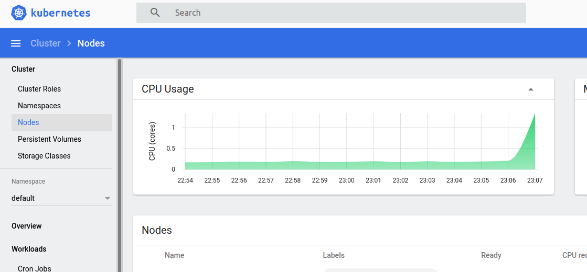

<span style="font-size:40px">LB2 - M300</span>

<span style="font-size:25px">Aaron Gensetter</span>

<br>

# Inhalt

# Einleitung
Für die LB1 vom Modul 300 habe ich mich für ein Projekt entschieden dass in Kapitel __make link__ weiter beschrieben wird.

Da ich auf einem Ubuntu 20.04 arbeite, werde ich nur die Installations- und Konfigurationsmethoden dafür erklären.

# 1 - Docker
## 1.1 - Installation
```shell
apt install docker.io
```

## 1.2 - Bedienung

```shell
$ docker run <container>
```

Mit __docker run__ kann ein Container auf verschiedene art und weisen gestartet werden, je nach argument.

```shell
$ docker ps
```

__docker ps__ gibt eine Liste der aktuellen Container aus.

```shell
$ docker images
```

__docker images__ gibt eine Liste der aktuellen lokalen images aus.

```shell
$ docker [container/image] rm <container>
```

Mit __docker rm__ können container und/oder Images gelöscht werden.

```shell
$ docker start <container>
```

Mit __docker start__ können container gestartet werden.

```shell
$ docker stop <container>
```

Mit __docker stop__ können container gestoppt werden.

```shell
$ docker kill <container>
```

Bei __docker kill__ wird der hauptprozess gekillt und der Container gestoppt.

## 1.3 - Dockerfile
Anweisungen

`FROM`

Welches Base Image von hub.docker.com verwendet werden soll, z.B. ubuntu:16.04

`ADD`

Kopiert Dateien aus dem Build Context oder von URLs in das Image.

`CMD`

Führt die angegebene Anweisung aus, wenn der Container gestartet wurde. Ist auch ein ENTRYPOINT definiert, wird die Anweisung als Argument für ENTRYPOINT verwendet.

`COPY`

Wird verwendet, um Dateien aus dem Build Context in das Image zu kopieren. Es gibt die zwei Formen COPY src dest und COPY ["src", "dest"]. Das JSON-Array-Format ist notwendig, wenn die Pfade Leerzeichen enthalten.

`ENTRYPOINT`

Legt eine ausführbare Datei (und Standardargumente) fest, die beim Start des Containers laufen soll.
Jegliche CMD-Anweisungen oder an docker run nach dem Imagenamen übergebenen Argumente werden als Parameter an das Executable durchgereicht.
ENTRYPOINT-Anweisungen werden häufig genutzt, um "Start-Scripts" anzustossen, die Variablen und Services initialisieren, bevor andere übergebene Argumente ausgewertet werden.

`ENV`

Setzt Umgebungsvariablen im Image.

`EXPOSE`

Erklärt Docker, dass der Container einen Prozess enthält, der an dem oder den angegebenen Port(s) lauscht.

`HEALTHCHECK`

Die Docker Engine prüft regelmässig den Status der Anwendung im Container.
HEALTHCHECK --interval=5m --timeout=3s \ CMD curl -f http://localhost/ || exit 1`

`MAINTAINER`

Setzt die "Autor-Metadaten" des Image auf den angegebenen Wert.

`RUN`

Führt die angegebene Anweisung im Container aus und bestätigt das Ergebnis.

`SHELL`

Die Anweisung SHELL erlaubt es seit Docker 1.12, die Shell für den folgenden RUN-Befehl zu setzten. So ist es möglich, dass nun auch direkt bash, zsh oder Powershell-Befehle in einem Dockerfile genutzt werden können.

`USER`

Setzt den Benutzer (über Name oder UID), der in folgenden RUN-, CMD- oder ENTRYPOINT-Anweisungen genutzt werden soll.

`VOLUME`

Deklariert die angegebene Datei oder das Verzeichnis als Volume. Besteht die Datei oder das Verzeichnis schon im Image, wird sie bzw. es in das Volume kopiert, wenn der Container gestartet wird.

`WORKDIR`

Setzt das Arbeitsverzeichnis für alle folgenden RUN-, CMD-, ENTRYPOINT-, ADD oder COPY-Anweisungen.

# 1.4 - PHP Webapp in Docker Container

Um einen PHP / Apache2 Server in einem Container laufen zu lassen, muss folgendes gemacht werden.

## 1.4.1 - Vorbereitung

Als erstes sollte ein Verzeichnis erstellt werden.

```shell
$ mkdir ~/m300/webapp
$ mkdir ~/m300/webapp/web
$ cd ~/m300/webapp/
```

Wenn das verzeichnis erstellt wurde, kann die "Webapplikation"/"Website" erstellt werden.

```shell
$ nano ~/m300/webapp/web/index.php
```

```php
<?php
echo '<html>';
echo '<head>';
echo '<link rel="stylesheet" href="style.css"/>';
echo '<title>M300 - Basis Container</title>';
echo '</head>';
echo '<body>';
echo '<div>';
echo 'MATH!<br />';
echo 'By Aaron Gensetter<br /><br /><br />';
if(isset($_GET['num1']) && isset($_GET['num2'])) {
    if(is_numeric($_GET['num1']) && is_numeric($_GET['num2'])) {
        
        $res = $_GET['num1'] + $_GET['num2'];

        echo "The Result is: {$_GET['num1']} + {$_GET['num2']} = <b>{$res}</b>";

        exit();
    }
}
echo 'Welcome to Math!<br /><br />';
echo 'We will add two numbers for you!<br />';
echo 'Please enter two numbers in a GET Request, like: 10.10.200.236:8080/?num1=17&num2=18';
echo '</div>';
echo '</body>';
echo '</html>';
```

```shell
$ nano ~/m300/webapp/web/style.css
```

```css
body {
    margin: 0;
    padding: 0;
    background-color: #1c1c1c;
    width: 100vw;
    height: 100vh;
    display: flex;
    justify-content: center;
    align-items: center;
    font-family: sans-serif;
    color: white;

}
body div {
    padding: 30px;
    background-color: #7c7c7c;
    border-radius: 5px;
}
```

## 1.4.2 - Image bauen

Um nun ein Image zu bauen, muss ein __Dockerfile__ erstellt werden. Für unseren PHP / Apache2 Server, wird das Basis Image von PHP mit einem Apache Server genommen, namens: __php:apache__.

```shell
$ nano Dockerfile
```

```txt
FROM php:apache
LABEL MAINTAINER=aaron.gensetter@edu.tbz.ch
WORKDIR /var/www/html
COPY ./web/index.php index.php
COPY ./web/style.css style.css
EXPOSE 80
```

Image erstellen / builden.

```shell
$ docker image build -t aarongen/web:1.0 .
```
```text
Sending build context to Docker daemon   5.12kB
Step 1/6 : FROM php:apache
apache: Pulling from library/php
b4d181a07f80: Pull complete 
78b85dd8f014: Pull complete 
8589b26a90be: Pull complete 
f5af5d641946: Pull complete 
614ec6f0b8d6: Pull complete 
12b28f3797fb: Pull complete 
96bcb7d2e6b0: Pull complete 
2b22e865defb: Pull complete 
a11c288f9bbd: Pull complete 
a7d336f7dd79: Pull complete 
11caf1780a9a: Pull complete 
cf16e972ea50: Pull complete 
b6621f6d9a60: Pull complete 
Digest: sha256:9c290f78c7c9e14fb081fe49ce1345c7d6b3a577f0ab829fec9ca8a30677d3ef
Status: Downloaded newer image for php:apache
 ---> 88b1572dce2d
Step 2/6 : LABEL MAINTAINER=aaron.gensetter@edu.tbz.ch
 ---> Running in 06a4ecea5aa4
Removing intermediate container 06a4ecea5aa4
 ---> c6509da1d3d4
Step 3/6 : WORKDIR /var/www/html
 ---> Running in 3772e4076cde
Removing intermediate container 3772e4076cde
 ---> fd8fa03d64a6
Step 4/6 : COPY ./web/index.php index.php
 ---> c110ad225360
Step 5/6 : COPY ./web/style.css style.css
 ---> 2f72011b4125
Step 6/6 : EXPOSE 80
 ---> Running in a6d80f9f1cea
Removing intermediate container a6d80f9f1cea
 ---> 52661fc88775
Successfully built 52661fc88775
Successfully tagged aarongen/web:1.0
```

## 1.4.3 - Testen

Um nun das gerade gebaute Image zu testen, kann es mit dem __docker container run__ Befehl gestartet werden.\
Es werden noch die zusatzoptionen __--detach__ (startet im Hintergrund), __--name__ (Gibt dem Container einen Namen) und __-p__ (leitet den port 8080 auf den Guestport 80 um) verwendet.
 
```shell
$ docker container run --detach --name web -p 8080:80 aarongen/web:1.0
```

Standardmässig wird man mit einer kleinen Anleitung begrüsst.



Wenn nun der Anleitung folge geleistet wird, und beide Nummern eingetragen werden, wird einem das Resultat präsentiert.


## 1.4.4 - Docker Hub

Um das Image in ein Repository auf Docker Hub zu laden, muss man sich erst mitseiner Docker Hub ID anmelden, danach kann das Image gepusht werden.

```shell
$ docker login --username=aarongen
```

```shell
$ docker image push aarongen/web:1.0
```

Das Image sollte nun auf dem eigenen Profil zu sehen sein.


# 2 - Kubernetes
## 2.1 - Installation

Ich verwende hier ein Ubuntu Server 20.04 als Basis.

```shell
$ snap install microk8s --classic
$ apt install docker.io
```

User berechtigen.

```shell
$ usermod -a -G microk8s <user>
$ chown -f -R <user> ~/.kube
```

Zum starten, müssen noch einige module nachgeladen werden.

```shell
$ microk8s.enable dashboard dns ingress registry
```

## 2.2 - Befehle

Um den Service zu starten.

```shell
$ microk8s.start
```

Um den Service zu stoppen.

```shell
$ microk8s.stop
```

Um den Status abzufragen.

```shell
$ microk8s.status
```

Um mit Kubectl zu interagieren.

```shell
$ microk8s.kubectl
```

## 2.3 - Dashboard

Um das Dashboard zu aktivieren, muss folgendes getan werden.

```shell
$ microk8s dashboard-proxy # Erlaubt zugriff auf Dashboard
```

Jetzt kann über folgende url auf das Dashboard zugegriffen werden: __\<ip>:10443__.


Nun muss der zuvor im Terminal angezeigte Token eingegeben werden.


Nun ist man im Dashboard angekommen.



## 2.4 - Simpler Container

### 2.4.1 - Vorbereitung

Als erstes sollte ein Verzeichnis erstellt werden.

```shell
$ mkdir ~/m300/webapp
$ mkdir ~/m300/webapp/web
$ cd ~/m300/webapp/
```

### 2.4.2 - Deployen
Da wir ja im Kapitel 1.4 ja schon ein Docker image erstellt und auf Docker Hub hochgeladen haben, können wir dieses jetzt wiederverwenden.

# 800 - Projekt
## 800.1 - Projekt Umfang
xxxxx

### Ziele:
xxxx

## 800.2 - Umgebung vorbereiten
### 800.2.1 - Server
Für dieses Projekt werde ich nicht auf die TBZ Cloud setzen, sondern eine eigene VM auf meinem Proxmox Server installieren, auf dieser werden alle docker Container ausgeführt.

```shell
$ apt install docker.io
```

## 800.3 - Dockerfile


## 800.800 Testing
# 900 - Reflexion

Ich habe in diesem Modul das erste mal mit docker und Kubernetes gearbeitet. Für die LB2 hatte ich leider nicht so viel zeit wie für die LB1, deshalb ist sie ein wenig kürzer ausgefallen, ich habe aber dennoch sehr viel dazugelernt, und hoffe das ich dieses Wissen auch noch in zukunft brauchen kann/werde.

# 1000 - Quellen

- MC-B github: https://github.com/mc-b/M300/tree/master [22.06.2021]
- Inhaltsverzeichnis: https://ecotrust-canada.github.io/markdown-toc/ [22.06.2021]
- K8s: https://www.youtube.com/watch?v=wN6FlmPy2qA&list=WL&index=7&t=618s [26.06.2021]

<br><br>

<a rel="license" href="http://creativecommons.org/licenses/by-nc-sa/3.0/ch/">

</a><br />Dieses Werk ist lizenziert unter einer <a rel="license" href="http://creativecommons.org/licenses/by-nc-sa/3.0/ch/">Creative Commons Namensnennung - Nicht-kommerziell - Weitergabe unter gleichen Bedingungen 3.0 Schweiz Lizenz</a>