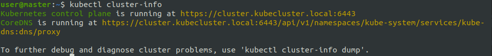

<span style="font-size:40px">LB2 - M300</span>

<span style="font-size:25px">Aaron Gensetter</span>

<br>

# Inhalt

- [Inhalt](#inhalt)
- [Einleitung](#einleitung)
- [1 - Docker](#1---docker)
  - [1.1 - Installation](#11---installation)
  - [1.2 - Bedienung](#12---bedienung)
  - [1.3 - Dockerfile](#13---dockerfile)
  - [1.4 - PHP Webapp in Docker Container](#14---php-webapp-in-docker-container)
    - [1.4.1 - Vorbereitung](#141---vorbereitung)
    - [1.4.2 - Image bauen](#142---image-bauen)
    - [1.4.3 - Testen](#143---testen)
    - [1.4.4 - Docker Hub](#144---docker-hub)
- [2 - Kubernetes](#2---kubernetes)
  - [2.1 - Installation](#21---installation)
  - [2.2 - Befehle](#22---befehle)
  - [2.3 - Dashboard](#23---dashboard)
  - [2.4 - Simpler Container](#24---simpler-container)
    - [2.4.1 - Vorbereitung](#241---vorbereitung)
    - [2.4.2 - Deployment erstellen](#242---deployment-erstellen)
  - [2.5 - Cluster Installieren](#25---cluster-installieren)
    - [2.5.1 - Vorbereiten](#251---vorbereiten)
    - [2.5.1 - Installation](#251---installation)
- [800 - Projekt](#800---projekt)
  - [800.1 - Projekt Umfang](#8001---projekt-umfang)
    - [Ziele:](#ziele)
  - [800.2 - Umgebung vorbereiten](#8002---umgebung-vorbereiten)
    - [800.2.1 - Server](#80021---server)
  - [800.3 - Dockerfile](#8003---dockerfile)
  - [800.800 Testing](#800800-testing)
- [900 - Reflexion](#900---reflexion)
- [1000 - Quellen](#1000---quellen)

# Einleitung
Für die LB1 vom Modul 300 habe ich mich für ein Projekt entschieden dass in Kapitel __make link__ weiter beschrieben wird.

Da ich auf einem Ubuntu 20.04 arbeite, werde ich nur die Installations- und Konfigurationsmethoden dafür erklären.

# 1 - Docker
## 1.1 - Installation
```shell
apt install docker.io
```

## 1.2 - Bedienung

```shell
$ docker ps
```

oder 

```shell
$ docker container ls
```

__docker ps__ gibt eine Liste der aktuellen Container aus.

```shell
$ docker images
```

oder

```shell
$ docker image ls
```

__docker images__ oder __docker image ls__ gibt eine Liste der aktuellen lokalen images aus.


```shell
$ docker [container/image] rm <container/image:version>
```

Mit __docker rm__ können container und/oder Images gelöscht werden.

```shell
$ docker start <container>
```

Mit __docker start__ können container gestartet werden.

```shell
$ docker stop <container>
```

Mit __docker stop__ können container gestoppt werden.

```shell
$ docker kill <container>
```

Bei __docker kill__ wird der hauptprozess gekillt und der Container gestoppt.

```shell
$ docker image build -t <name>:<version> <path>
```

mit ___docker image build__ kann ein Image aus einem Dockerfile erstellt werden

```shell
$ docker image push <name>:<version>
```

Mit __docker image push__ kann ein Image auf dockerhub geladen und versioniert  werden.

```shell
$ docker container run --detach --name <name> -p <hostPort>:<guestPort> <image>:<version>
```

Mit dem obigen befehl, lässt sich ein Image in einem im hintergrund laufenden Container starten, dieser leitet den port 8080 auf den internen port 80 um.

```shell
$ docker pull <image>:<version>
```

Mit __docker pull__ kann ein Image von dockerhub heruntergeladen werden.

```shell
$ docker exec -d <containerName/ID> <shellCommand>
```

Mit __docker exec__ kann ein Befehl in einem container ausgeführt werden.


## 1.3 - Dockerfile
Anweisungen

`FROM`

Base Image das verwerdet werden soll.

`ADD`

Kopiert Dateien aus dem Build Context oder von URLs in das Image.

`CMD`

Führt die angegebene Anweisung aus, wenn der Container gestartet wurde. Ist auch ein ENTRYPOINT definiert, wird die Anweisung als Argument für ENTRYPOINT verwendet.

`COPY`

Wird verwendet, um Dateien aus dem Build Context in das Image zu kopieren. Es gibt die zwei Formen COPY src dest und COPY ["src", "dest"]. Das JSON-Array-Format ist notwendig, wenn die Pfade Leerzeichen enthalten.

`ENTRYPOINT`

Legt eine ausführbare Datei (und Standardargumente) fest, die beim Start des Containers laufen soll.
Jegliche CMD-Anweisungen oder an docker run nach dem Imagenamen übergebenen Argumente werden als Parameter an das Executable durchgereicht.
ENTRYPOINT-Anweisungen werden häufig genutzt, um "Start-Scripts" anzustossen, die Variablen und Services initialisieren, bevor andere übergebene Argumente ausgewertet werden.

`ENV`

Setzt Umgebungsvariablen im Image.

`EXPOSE`

Erklärt Docker, dass der Container einen Prozess enthält, der an dem oder den angegebenen Port(s) lauscht.

`HEALTHCHECK`

Die Docker Engine prüft regelmässig den Status der Anwendung im Container.
HEALTHCHECK --interval=5m --timeout=3s \ CMD curl -f http://localhost/ || exit 1`

`MAINTAINER`

Setzt die "Autor-Metadaten" des Image auf den angegebenen Wert.

`RUN`

Führt die angegebene Anweisung im Container aus und bestätigt das Ergebnis.

`SHELL`

Die Anweisung SHELL erlaubt es seit Docker 1.12, die Shell für den folgenden RUN-Befehl zu setzten. So ist es möglich, dass nun auch direkt bash, zsh oder Powershell-Befehle in einem Dockerfile genutzt werden können.

`USER`

Setzt den Benutzer (über Name oder UID), der in folgenden RUN-, CMD- oder ENTRYPOINT-Anweisungen genutzt werden soll.

`VOLUME`

Deklariert die angegebene Datei oder das Verzeichnis als Volume. Besteht die Datei oder das Verzeichnis schon im Image, wird sie bzw. es in das Volume kopiert, wenn der Container gestartet wird.

`WORKDIR`

Setzt das Arbeitsverzeichnis für alle folgenden RUN-, CMD-, ENTRYPOINT-, ADD oder COPY-Anweisungen.

## 1.4 - PHP Webapp in Docker Container

Um einen PHP / Apache2 Server in einem Container laufen zu lassen, muss folgendes gemacht werden.

### 1.4.1 - Vorbereitung

Als erstes sollte ein Verzeichnis erstellt werden.

```shell
$ mkdir ~/m300/webapp/ # verzeichnis für Docker stuff
$ mkdir ~/m300/webapp/web/ # verzeichnis für website
$ cd ~/m300/webapp/
```

Wenn das Verzeichnis erstellt wurde, kann die "Webapplikation"/"Website" erstellt werden.

```shell
$ nano ~/m300/webapp/web/index.php
```

```php
<?php
echo '<html>';
echo '<head>';
echo '<link rel="stylesheet" href="style.css"/>';
echo '<title>M300 - Basis Container</title>';
echo '</head>';
echo '<body>';
echo '<div>';
echo 'MATH!<br />';
echo 'By Aaron Gensetter<br /><br /><br />';
if(isset($_GET['num1']) && isset($_GET['num2'])) { # check if num1 and num2 are set in the GET request
    if(is_numeric($_GET['num1']) && is_numeric($_GET['num2'])) { # check if num1 and num2 are numbers
        
        $res = $_GET['num1'] + $_GET['num2'];

        echo "The Result is: {$_GET['num1']} + {$_GET['num2']} = <b>{$res}</b>"; # output the result to the page

        exit(); # then exit;
    }
}
echo 'Welcome to Math!<br /><br />';
echo 'We will add two numbers for you!<br />';
echo "Please enter two numbers in a GET Request, like: {$_SERVER['HTTP_HOST']}/?num1=17&num2=18"; # $_SERVER['HTTP_HOST'] == request Domain/ip + port
echo '</div>';
echo '</body>';
echo '</html>';
```

```shell
$ nano ~/m300/webapp/web/style.css
```

```css
body {
    margin: 0;
    padding: 0;
    background-color: #1c1c1c;
    width: 100vw;
    height: 100vh;
    display: flex;
    justify-content: center;
    align-items: center;
    font-family: sans-serif;
    color: white;

}
body div {
    padding: 30px;
    background-color: #7c7c7c;
    border-radius: 5px;
}
```

### 1.4.2 - Image bauen

Um nun ein Image zu bauen, muss ein __Dockerfile__ erstellt werden. Für den PHP / Apache2 Server, wird das Basis Image von PHP mit einem Apache Server genommen, namens: __php:apache__.

```shell
$ nano Dockerfile
```

```txt
FROM php:apache
LABEL MAINTAINER=aaron.gensetter@edu.tbz.ch
WORKDIR /var/www/html
COPY ./web/index.php index.php
COPY ./web/style.css style.css
EXPOSE 80
```

Image erstellen / builden.

```shell
$ docker image build -t aarongen/web:1.0 .
```

### 1.4.3 - Testen

Um nun das gerade gebaute Image zu testen, kann es mit dem __docker container run__ Befehl gestartet werden.\
Es werden noch die zusatzoptionen __--detach__ (startet im Hintergrund), __--name__ (Gibt dem Container einen Namen) und __-p__ (leitet den port 8080 auf den Guestport 80 um) verwendet.
 
```shell
$ docker container run --detach --name web -p 8080:80 aarongen/web:1.0
```

Standardmässig wird man mit einer kleinen Anleitung begrüsst.


Wenn nun der Anleitung folge geleistet wird, und beide Nummern eingetragen werden, wird einem das Resultat präsentiert.


### 1.4.4 - Docker Hub

Um das Image in ein Repository auf Docker Hub zu laden, muss man sich erst mit seiner Docker Hub ID anmelden, danach kann das Image gepusht werden.

```shell
$ docker login -u aarongen -p <password>
```

```shell
$ docker image push aarongen/web:1.0
```

Das Image sollte nun auf dem eigenen Profil zu sehen sein.


# 2 - Kubernetes
## 2.1 - Installation

Ich verwende hier ein Ubuntu Server 20.04 als Basis.

```shell
$ snap install microk8s --classic
$ apt install docker.io
```

User berechtigen.

```shell
$ usermod -a -G microk8s <user>
$ chown -f -R <user> ~/.kube
```

Zum starten, müssen noch einige module nachgeladen werden.

```shell
$ microk8s.enable dashboard dns ingress registry
```

## 2.2 - Befehle

Um den Service zu starten.

```shell
$ microk8s.start
```

Um den Service zu stoppen.

```shell
$ microk8s.stop
```

Um den Status abzufragen.

```shell
$ microk8s.status
```

Um mit Kubectl zu interagieren.

```shell
$ microk8s.kubectl <command>
```

Um details einer ressouce zu erhalten.

```shell
$ microk8s.kubectl describe <resource>
```

um die Logs eines pods anzuzeigen

```shell
$ microk8s.kubectl logs <pod>
```

Um einen Bashbefehl in einem pod auszuführen.

```shell
$ microk8s.kubectl exec <pod> <command>
```

Um ein YAML file zu applyen

```shell
$ microk8s.kubectl apply -f
```

Um informationen zu sammeln über...

```shell
$ microk8s.kubectl get services # alle Services anzeigen
$ microk8s.kubectl get pods # alle pods anzeigen
$ microk8s.kubectl get deployments # alle deployments anzeigen lassen
$ microk8s.kubectl get all # alles anzeigen
```

Um ... zu löschen.

```shell
$ microk8s.kubectl delete [service/pod/deployment] <name/id>
```

## 2.3 - Dashboard

Um das Dashboard zu aktivieren, muss folgendes getan werden.

```shell
$ microk8s dashboard-proxy # Erlaubt zugriff auf Dashboard
```

Jetzt kann über folgende url auf das Dashboard zugegriffen werden: __\<ip>:10443__.


Nun muss der zuvor im Terminal angezeigte Token eingegeben werden.


Nun ist man im Dashboard angekommen.


## 2.4 - Simpler Container

### 2.4.1 - Vorbereitung

Als erstes sollte ein Verzeichnis erstellt werden.

```shell
$ mkdir ~/m300/kubeconfigs/
$ mkdir ~/m300/kubeconfigs/webapp/
$ cd ~/m300/kubeconfigs/webapp/
```

### 2.4.2 - Deployment erstellen
Da wir ja im Kapitel 1.4 ja schon ein Docker image erstellt und auf Docker Hub hochgeladen haben, können wir dieses jetzt wiederverwenden.

In folgendem YAML file, wir ein Deployment erstellt, mit dem Namen webapp, und dem Image __"aarongen/webapp:1.0"__, das im Kapitel 1.4 erstellt wurde.
nach den __---__, wird ein Service erstellt, mit dem Namen webapp-service, er hat den type (Loadbalancer (external)). der TCP port 30000 wird auf den port 80 weitergeleitet.

```shell
$ nano deployment.yaml
```

```yaml
apiVersion: apps/v1
kind: Deployment
metadata:
   name: webapp
   labels:
      app: webapp
spec:
   replicas: 1
   selector:
      matchLabels:
         app: webapp
   template:
      metadata:
         labels:
            app: webapp
      spec:
         containers:
         - name: webapp
           image: aarongen/web:1.0
           ports:
           - containerPort: 80
---
apiVersion: v1
kind: Service
metadata:
   name: webapp-service
spec:
   selector:
      app: webapp
   type: LoadBalancer
   ports:
      - protocol: TCP
        port: 80
        targetPort: 80
        nodePort: 30000

```

Um das Ganze jetzt zu deployen, kann folgender befehl ausgeführt werden.

```shell
$ microk8s.kubectl apply -f deployment.yaml
```
```text
deployment.apps/webapp created
service/webapp-service created
```

Nun ist die Website via Browser "public" erreichbar.


## 2.5 - Cluster Installieren

### 2.5.1 - Vorbereiten

Als erster habe ich drei VMs auf meinem Proxmox Server erstellt.

| Type | OS | Hostname | IP |
| --- | --- | --- | --- |
| Master | ubuntu-server 20.04 | master.kubecluster.local | 10.10.200.130 |
| Worker | ubuntu-server 20.04 | worker1.kubecluster.local | 10.10.200.131 |
| Worker | ubuntu-server 20.04 | worker2.kubecluster.local | 10.10.200.132 |

Das erste was gemacht werden sollte, ist die Server zu updaten.

```shell
$ sudo apt update
$ sudo apt -y upgrade && sudo systemctl reboot
```

### 2.5.1 - Installation

Als erstes muss auf allen Servern "kubelet, kubeadm and kubectl" installiert werden.

Repos hinzufügen.

```shell
$ sudo apt -y install curl apt-transport-https
$ curl -s https://packages.cloud.google.com/apt/doc/apt-key.gpg | sudo apt-key add -
$ echo "deb https://apt.kubernetes.io/ kubernetes-xenial main" | sudo tee /etc/apt/sources.list.d/kubernetes.list
```

Packages Installieren.

```shell
$ sudo apt update
$ sudo apt -y install vim git curl wget kubelet kubeadm kubectl
$ sudo apt-mark hold kubelet kubeadm kubectl
```

Swap Deaktvieren.

```shell
$ sudo sed -i '/ swap / s/^\(.*\)$/#\1/g' /etc/fstab
$ sudo swapoff -a
```

sysctl Konfigurieren.

```shell
sudo modprobe overlay
sudo modprobe br_netfilter

sudo tee /etc/sysctl.d/kubernetes.conf<<EOF
net.bridge.bridge-nf-call-ip6tables = 1
net.bridge.bridge-nf-call-iptables = 1
net.ipv4.ip_forward = 1
EOF

sudo sysctl --system
```

Docker runtime.

```shell
$ sudo apt update
$ sudo apt install -y curl gnupg2 software-properties-common apt-transport-https ca-certificates
$ curl -fsSL https://download.docker.com/linux/ubuntu/gpg | $ sudo apt-key add -
$ sudo add-apt-repository "deb [arch=amd64] https://download.docker.com/linux/ubuntu $(lsb_release -cs) stable"
$ sudo apt update
$ sudo apt install -y containerd.io docker-ce docker-ce-cli

$ sudo mkdir -p /etc/systemd/system/docker.service.d

$ sudo tee /etc/docker/daemon.json <<EOF
{
  "exec-opts": ["native.cgroupdriver=systemd"],
  "log-driver": "json-file",
  "log-opts": {
    "max-size": "100m"
  },
  "storage-driver": "overlay2"
}
EOF

$ sudo systemctl daemon-reload 
$ sudo systemctl restart docker
$ sudo systemctl enable docker

```

Master node

```shell
$ sudo systemctl enable kubelet
```

```shell
$ sudo kubeadm config images pull
```

```shell
$ sudo nano /etc/hosts
```

```text
10.10.200.130 cluster.kubecluster.local
```

```shell
$ sudo kubeadm init \
--pod-network-cidr=192.168.0.0/16 \
--control-plane-endpoint=cluster.kubecluster.local
```

```shell
$ mkdir -p $HOME/.kube
$ sudo cp -i /etc/kubernetes/admin.conf $HOME/.kube/config
$ sudo chown $(id -u):$(id -g) $HOME/.kube/config
```

```shell
$ kubectl cluster-info
```



Network on Master.

```shell
kubectl apply -f https://docs.projectcalico.org/manifests/calico.yaml
```

Worker Nodes hinzufügen

** **auf den Nodes ausführen**
```shell
$ sudo nano /etc/hosts
```

```shell
10.10.200.130 cluster.kubecluster.local
```

** **auf dem MASTER ausführen**
```shell
$ kubeadm token create --print-join-command
```


** **auf den Nodes ausführen**

```shell
$ kubeadm join cluster.kubecluster.local:6443 --token <token> --discovery-token-ca-cert-hash <sha>
```


# 800 - Projekt
## 800.1 - Projekt Umfang
xxxxx

### Ziele:
xxxx

## 800.2 - Umgebung vorbereiten
### 800.2.1 - Server
Für dieses Projekt werde ich __nicht__ auf die TBZ Cloud setzen, sondern eine eigene VM auf meinem Proxmox Server installieren.

Als erstes habe ich einen einfachen Ubuntu Server 20.04 in meiner DMZ erstellt.

```shell
$ apt install docker.io # Docker Installieren
$ snap install microk8s --classic # Kubernetes Installieren
```

## 800.3 - Dockerfile


## 800.800 Testing
# 900 - Reflexion

Ich habe in diesem Modul das erste mal mit docker und Kubernetes gearbeitet. Für die LB2 hatte ich leider nicht so viel zeit wie für die LB1, deshalb ist sie ein wenig kürzer ausgefallen, ich habe aber dennoch sehr viel dazugelernt, und hoffe das ich dieses Wissen auch noch in zukunft brauchen kann/werde.

# 1000 - Quellen

- MC-B github: https://github.com/mc-b/M300/tree/master [22.06.2021]
- Inhaltsverzeichnis: https://ecotrust-canada.github.io/markdown-toc/ [22.06.2021]
- K8s: https://www.youtube.com/watch?v=wN6FlmPy2qA&list=WL&index=7&t=618s [26.06.2021]
- k8s Cluster: https://computingforgeeks.com/deploy-kubernetes-cluster-on-ubuntu-with-kubeadm/ [28.06.2021]

<br><br>

<a rel="license" href="http://creativecommons.org/licenses/by-nc-sa/3.0/ch/">

</a><br />Dieses Werk ist lizenziert unter einer <a rel="license" href="http://creativecommons.org/licenses/by-nc-sa/3.0/ch/">Creative Commons Namensnennung - Nicht-kommerziell - Weitergabe unter gleichen Bedingungen 3.0 Schweiz Lizenz</a>