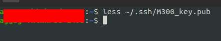
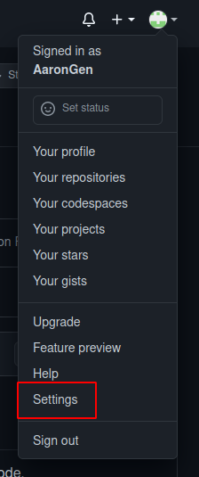
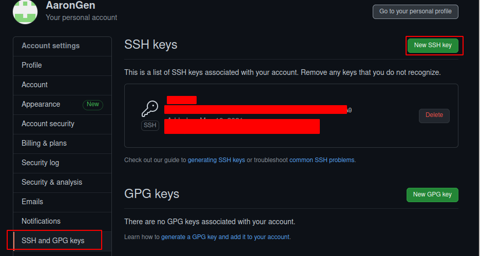
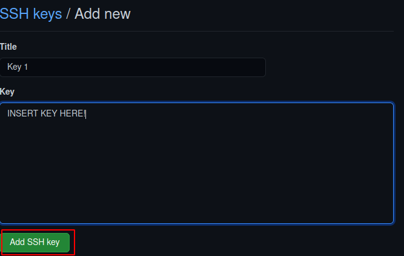
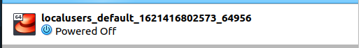
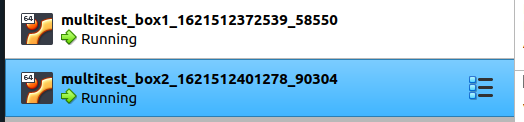
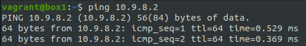
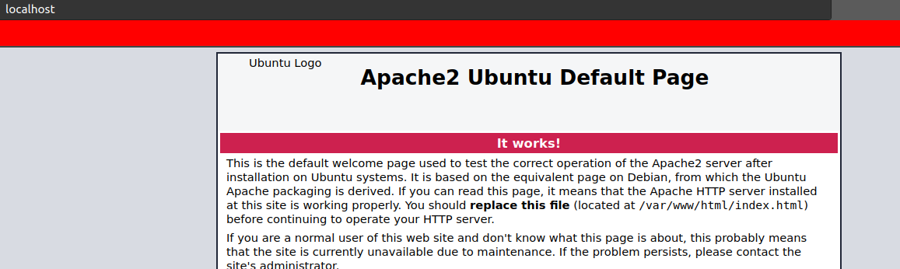

# Einleitung allgemein
Einleitung allgemein (Erklärungen zum ganzen M300-Projekt)

Aufgaben: https://github.com/mc-b/M300/tree/master/10-Toolumgebung

# 10-Toolumgebungen

## 10.01 - Git
### 10.01.1 - Github Account


1. Auf www.github.com ein Benutzerkonto erstellen (Angabe von Username, E-Mail und Passwort)
2. E-Mail zur Verifizierung des Kontos bestätigen und anschliessend auf GitHub anmelden


Github account erstellt: https://github.com/AaronGen

### 10.01.2 - Repository

Repository erstellen
1. Anmelden unter www.github.com
2. Innerhalb der Willkommens-Seite auf Start a project klicken
3. Unter Repository name einen Name definieren (z.B. M300-Services)
4. Optional: kurze Beschreibung eingeben
5. Radio-Button bei Public belassen
6. Haken bei Initialize this repository with a README setzen
7. Auf Create repository klicken

<b>Name</b>: M300-Services\
<b>Description:</b> Microservices / Containerumgebung\
<b>Status:</b> Private

Repository Klonen
```Shell
$ git clone <Repository>
```
Pullen
```Shell
$ git pull
```
Status prüfen
```Shell
$ git status
```
Status pushen
```Shell
$ git add .
$ git commit -m "<nachricht>"
$ git push
```
### 10.01.3 - SSH-KEY

Zuerst muss in der Konsole einen SSH Key erstellt werden

```Shell 
$ ssh-keygen -t rsa -b 4096

Generating public/private rsa key pair.
Enter a file in which to save the key (~/.ssh/id_rsa): ~/.ssh/M300_key
Enter passphrase (empty for no passphrase): [Passwort]
Enter same passphrase again: [Passwort wiederholen]
```

Nachdem der Key erstellt wurde, muss er im Terminal angezeigt werden, dies muss mit folgendem Befehl getan werden.\
\
Wenn der Public key nun in der Konsole angezeigt wird, diesen Kopieren.\


\
Den zuvor kopierten Public Key hier unter KEY Pasten.\
Der Name kann frei gewählt werden.\


Wenn der Key nun in Github eingetragen ist, muss er auf dem Lokalen PC noch mit dem Repository verbunden werden.

```Shell 
$ ssh git@github.com -T -i ~/.ssh/<dein KEY>
Hi User! Youve successfully authenticated, but GitHub does not provide shell access.
Connection to github.com closed.

$ cd /pfad/zu/repository
$ git init
$ git remote add origin https://github.com/<dein Username>/<dein GIT Repository>
$ git remote set-url git@github.com:<dein Username>/<dein GIT Repository>
$ git pull origin master
```

### 10.01.4 - Git
<b>Installieren</b>\
<b>Linux</b>

```Shell 
apt install git
```
<b>Windows</b>

Wenn Git unter Windows Installiert werden soll "Would not recommend", hier downloaden\
https://git-scm.com/downloads

<b>Konfiguration</b>

```Shell 
$ git config --global user.name "<username>"
$ git config --global user.email "<e-mail>"
```
## 10.02 - Virtualbox
### 10.02.1 - Installation
<b>Linux</b>
```Shell 
$ apt install virtualbox
```
<b>Windows</b>

Folgendes File Installieren und dem Wizard folgen\
https://download.virtualbox.org/virtualbox/6.1.22/VirtualBox-6.1.22-144080-Win.exe

### 10.02.2 - VM erstellen
Daten: 
Name: M300_Ubuntu_20.04_Desktop\
Typ: Linux x64\
RAM: 2048 MB\
Festplatte: 10 GB\
Festplatten Typ: VMDK → dynamisch alloziert

### 10.02.3 VM Konfigurieren
Updaten und Upgraden
```Shell 
$ apt update
$ apt upgrade -y
```
Synaptic Installieren
```Shell 
$ apt install synaptic
```

## 10.03 - Vagrant
### 10.03.1 - Installation
<b>Linux</b>

```Shell 
$ apt install vagrant
```

<b>Windows</b>\
Auf folgenden Link drücken, Downloaden und dem Wizard folgen:\
https://www.vagrantup.com/downloads

### 10.03.2 - Bedienung
<b>Einfache VM Erstellen</b>
1. Verzeichniss erstellen

```Shell 
$ mkdir ~/vagrant/box1
```
2. VM Initialisieren\
**Wichtig, dieser befehl muss im eben erstellten Verzeichniss ausgeführt werden

```Shell 
$ vagrant init <user>/<box>
    Beispiel für box:
        vagrant init ubuntu/xenial64
```
3. Vagrant VM starten\
**Wichtig, dieser befehl muss im eben erstellten Verzeichniss ausgeführt werden
```Shell 
$ vagrant up
```
<b>Vagrant Befehle und Konfiguraionen</b>

Vagrant box herunterladen
```Shell 
$ vagrant box add <user>/<Box>
```
Die Boxen könenn hier gefunden werden: https://app.vagrantup.com/boxes/search

Box Initialisieren
```Shell 
$ vagrant init <user>/<box>
```

Box Starten
```Shell 
$ vagrant up
oder: vagrant up (<boxname>) (wenn mehrere boxen im Vagantfile vorhanden sind)
```

Box Stoppen
```Shell 
$ vagrant halt
oder: vagrant halt (<boxname>) (wenn mehrere boxen im Vagantfile vorhanden sind)
```

Box Anhalten
```Shell 
$ vagrant suspend
oder: vagrant suspend (<boxname>) (wenn mehrere boxen im Vagantfile vorhanden sind)
```

Box Löschen
```Shell 
$ vagrant destroy
```

Direkt ssh verbindung zu Box
```Shell 
$ vagrant ssh 
oder: vagrant ssh (<boxname>) (wenn mehrere boxen im Vagantfile vorhanden sind)
``` 
mit "exit" kommt man wieder aus der SSH Session

Um den Status einer Box herauszufinden.
```Shell 
$ vagrant status
oder: vagrant status (<boxname>) (wenn mehrere boxen im Vagantfile vorhanden sind)
```

Dies gibt folgenden output

```Shell 
Current machine states:

default                   running (virtualbox)
```

oder 

```Shell 
Current machine states:

default                   poweroff (virtualbox)
```

oder 

```Shell 
Current machine states:

default                   saved (virtualbox)
```

| Befehl                    | Beschreibung                                                      |
| ------------------------- | ----------------------------------------------------------------- | 
| `vagrant init`            | Initialisiert im aktuellen Verzeichnis eine Vagrant-Umgebung und erstellt, falls nicht vorhanden, ein Vagrantfile |
| `vagrant up`              |  Erzeugt und Konfiguriert eine neue Virtuelle Maschine, basierend auf dem Vagrantfile |
| `vagrant ssh`             | Baut eine SSH-Verbindung zur gewünschten VM auf                   |
| `vagrant status`          | Zeigt den aktuellen Status der VM an                              |
| `vagrant port`            | Zeigt die Weitergeleiteten Ports der VM an                        |
| `vagrant halt`            | Stoppt die laufende Virtuelle Maschine                            |
| `vagrant destroy`         | Stoppt die Virtuelle Maschine und zerstört sie.                   |

<br><br>
<b>Vagrantfile</b>
Das Vagrantfile befindet sich in dem Ordner in dem man den Befehl vagrant init ausgeführt hat, es sieht ohne weitere Optionen folgendermassen aus.

```Shell 
Vagrant.configure("2") do |config|
  config.vm.box = "user/box"
end
```
Die vagrant VMs werden standartmässig in Virtualbox laufen gelassen, solange man dies im Vagrantfile nicht ändert.


Nach dem Editieren des vagrantfiles, muss folgender befehl ausgeführt werden
```Shell 
$ vagrant reload
``` 

Um ein Hostname zu geben, muss man das Vagrantfile folgendermasen editieren
unter config.vm.box = ""
```Shell 
config.vm.hostname = "dein Hostname"
```

Um eine IP Adresse zu setzen, muss man das Vagrantfile folgendermasen editieren
```Shell 
config.vm.network "private_network", ip: "10.9.8.7"
```

<b>Mehrere Vms erstellen</b>\
Mit Vagrant ist es möglich mehrere Vms mit nur einem File zu erstellen, dies Zeige ich hier anhand eines Beispieles.

```Shell 
$ cd /path/to/vmstorage
$ mkdir multivm
$ cd multivm
$ vagrant init ubuntu/xenial64
$ nano Vagrantfile
```
```Shell 
FilePath: /path/to/vmstorage/multivm/Vagrantfile

-------------------------------------------------

Vagrant.configure("2") do |config|
  config.vm.box = "ubuntu/xenial64" #Select box Image

  # Define Box 1
  config.vm.define "box1" do |box1|
   box1.vm.hostname = "box1"
   box1.vm.network "private_network", ip: "10.9.8.1"
  end

  # Define Box 2
  config.vm.define "box2" do |box2|
   box2.vm.hostname = "box2"
   box2.vm.network "private_network", ip: "10.9.8.2"
  end

end
```
Um die VMs zu starten
```Shell 
$ vagrant up
umd nur eine der beiden zu starten: vagrant up box1 oder box2
```
Nun laufen die beiden VMs und sie können auch miteinander kommunizieren.\


Um eine der beiden VMs zu **kontrollieren**
```Shell 
$ vagrant ssh box1
oder
$ vagrant ssh box2
```



<b>Automatisch bash befehle beim erstellen ausführen</b>

Folgender Punkt muss auskommentiert weden, und die Befehle können dazwischen geschrieben werden, in desem Beispiel werde ich einen Apache Server installieren und das System updaten
```Shell
config.vm.provision "shell", inline: <<-SHELL
   apt-get update
   apt-get install -y apache2
SHELL
```

### 10.03.3 - Webserver

```Shell 
cd ~/gitrep/M300/vagrant/web
vagrant up
```


## 10.04 - VSCode
### 10.04.1 - Installation
<b>Linux</b>

```Shell 
snap install --classic code
```

<b>Windows</b>

Auf dem folgenden Linux drücken und dem Wizard folgen.\
https://code.visualstudio.com/

# 20 - Infrastruktur
## 20.01 - Arten von Cloudcomputing

<b>Infrastruktur – Infrastructure as a Service (IaaS)</b>\
Die Infrastruktur (auch "Cloud Foundation") stellt die unterste Schicht im Cloud Computing dar. Der Benutzer greift hier auf bestehende Dienste innerhalb des Systems zu, verwaltet seine Recheninstanzen (virtuelle Maschinen) allerdings weitestgehend selbst.

<b>Plattform – Platform as a Service (PaaS)</b>\
Der Entwickler erstellt die Anwendung und lädt diese in die Cloud. Diese kümmert sich dann selbst um die Aufteilung auf die eigentlichen Verarbeitungseinheiten. Im Unterschied zu IaaS hat der Benutzer hier keinen direkten Zugriff auf die Recheninstanzen. Er betreibt auch keine virtuellen Server.

<b>Anwendung – Software as a Service (SaaS)</b>\
Die Anwendungssicht stellt die abstrakteste Sicht auf Cloud-Dienste dar. Hierbei bringt der Benutzer seine Applikation weder in die Cloud ein, noch muss er sich um Skalierbarkeit oder Datenhaltung kümmern. Er nutzt eine bestehende Applikation, die ihm die Cloud nach aussen hin anbietet.

Mit dem Advent von Docker (Containierisierung) hat sich zwischen IaaS und PaaS eine neue Ebene geschoben:

<b>CaaS (Container as a Service)</b>\
Diese Ebene ist dafür zuständig, containerisierten Workload auf den Ressourcen auszuführen, die eine IaaS-Cloud zur Verfügung stellt. Die Technologien dieser Ebene wie Docker, Kubernetes oder Mesos sind allesamt quelloffen verfügbar. Somit kann man sich seine private Cloud ohne Gefahr eines Vendor Lock-ins aufbauen.

Beispiele:

    Public Cloud
        AWS, Azure, Digital Ocean, Google, exoscale
    Private Cloud
        CloudStack, OpenStack, VMware vCloud
    Lokale Virtualisierung
        Oracle VirtualBox, Hyper-V, VMware Player
    Hyperkonvergente Systeme
        Rechner die die oben beschriebenen Eigenschaften in einer Hardware vereinen

Beispiele:
 
    Programmierbar
        Ein Userinterface ist zwar angenehm und viele Cloud Anbieter haben ein solches, aber für IaC muss die Plattform via Programmierschnittstelle (API) ansprechbar sein.
    On-demand
        Ressourcen (Server, Speicher, Netzwerke) schnell erstellen und vernichtet.
    Self-Service
        Ressourcen anpassen und auf eigene Bedürfnisse zuschneiden.
    Portabel
        Anbieter von Ressourcen (z.B. AWS, Azure) müssen austauschbar sein.
    Sicherheit, Zertifizierungen (z.B. ISO 27001), etc.

Ziele von Infrastructure as a Code (IaC) sind:

- IT-Infrastruktur wird unterstützt und ermöglicht Veränderung, anstatt Hindernis oder Einschränkung zu sein.
- Änderungen am System sind Routine, ohne Drama oder Stress für Benutzer oder IT-Personal.
- IT-Mitarbeiter verbringen ihre Zeit für wertvolle Dinge, die ihre Fähigkeiten fördern und nicht für sich wiederholende Aufgaben.
- Fachanwender erstellen und verwalten ihre IT-Ressourcen, die sie benötigen, ohne IT-Mitarbeiter
- Teams sind in der Lage, einfach und schnell, ein abgestürztes System wiederherzustellen.
- Verbesserungen sind kontinuierlich und keine teuren und riskanten "Big Bang" Projekte.
- Lösungen für Probleme sind durch Implementierung, Tests, und Messen institutionalisiert, statt diese in Sitzungen und Dokumente zu erörtern.

Definitionen
- Versionsverwaltung - Version Control Systems (VCS)
- Testgetriebene Entwicklung - Testdriven Development (TDD)
- Kontinuierliche Integration - Continuous Integration (CI)
- Kontinuierliche Verteilung - Continuous Delivery (CD)

## 20.02 Packer

Packer ist ein Tool zur Erstellung von Images bzw. Boxen für eine Vielzahl von Dynamic Infrastructure Platforms mittels einer Konfigurationsdatei.

# 25 - Sicherheit 1
Ausgabe von allen offenen ports 

```Shell 
$ apt install net-tools
$ netstat -tulpn
```

## UFW
### Installation
```Shell 
apt install ufw
```

Bedienen
```Shell 
$ sudo ufw status
$ sudo ufw enable
$ sudo ufw disable
```

Regeln öffnen
```Shell 
# Port 80 (HTTP) öffnen für alle
$ ufw allow 80/tcp

# Port 22 (SSH) nur für den Host (wo die VM laufen) öffnen
$ ufw allow from [Meine-IP] to any port 22

# Port 3306 (MySQL) nur für den web Server öffnen
$ ufw allow from [IP der Web-VM] to any port 3306
```

Regeln schliessen
```Shell 
# Port 80 (HTTP) öffnen für schliessen
$ ufw deny 80/tcp
```

Testen
```Shell 
$ curl -f 192.168.55.101
$ curl -f 192.168.55.100:3306
```

Regeln Löschen
```Shell 
$ sudo ufw status numbered
$ sudo ufw delete 1
```

## Revere Proxy Apache
## Installation

```Shell 
$ apt install apache2
$ apt install libapache2-mod-proxy-html
$ apt install libxml2-dev

$ a2enmod proxy
$ a2enmod proxy_html
$ a2enmod proxy_http 
```
## Konfiguration
Die Datei /etc/apache2/apache2.conf wie folgt ergänzen:
```Shell 
ServerName localhost 
```

Apache Server neustarten
```Shell 
$ sudo service apache2 restart
```

Um eine Weiterleitung zu kreiren, das File sites-enabled/001-reverseproxy.conf erstellen / bearbeiten
```Shell 
    # Allgemeine Proxy Einstellungen
    ProxyRequests Off
    <Proxy *>
        Order deny,allow
        Allow from all
    </Proxy>

    # Weiterleitungen master
    ProxyPass /master http://master
    ProxyPassReverse /master http://master
```

# 30 - Container
Text

# 35 - Sicherheit 2
Text

# 40 - Container-Orchestrierung
Text

# 50 - Add-ons
Eigene Ergänzungen erwünscht

# 60 - Reflexion

20.05.21
Ich habe mich in diesem Modul das erste mal mit Vagrant auseinander Gesetzt und vieles darüber gelernt

# 70 - Quellen

Aufgaben und einige Texte: https://github.com/mc-b/M300/tree/master
- - -
<a rel="license" href="http://creativecommons.org/licenses/by-nc-sa/3.0/ch/"></a><br />Dieses Werk ist lizenziert unter einer <a rel="license" href="http://creativecommons.org/licenses/by-nc-sa/3.0/ch/">Creative Commons Namensnennung - Nicht-kommerziell - Weitergabe unter gleichen Bedingungen 3.0 Schweiz Lizenz</a>

- - -